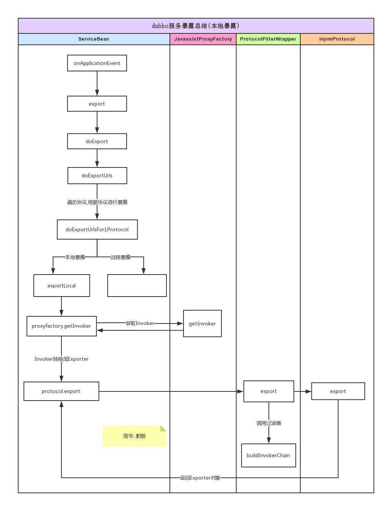

# Dubbo

```properties
1. 深入理解 Dubbo 内核
	SPI、Adaptive、Wrapper 与 Activate（具体设计原则）
2. 深入理解 Dubbo 内置负载均衡
	加权随机算法、加权最小活跃度算法、双权重轮询算法、一致性hash算法
3. 深入理解 Dubbo 微服务治理
	拆分、降级、容错、熔断、限流（原理与手段）
```

## Dubbo框架设计结构


1. `service` 服务接口层：该层是与实际业务逻辑相关的，根据服务提供方和服务消费方的业务设计对应的接口和实现。
2. `config` 配置层：对外配置接口，以`ServiceConfig`和`ReferenceConfig`为中心，可以直接new配置类，也可以通过spring解析配置生成配置类。
3. `proxy` 服务代理层：服务接口透明代理，生成服务的客户端Stub和服务器端Skeleton，以`ServiceProxy`为中心，扩展接口为`ProxyFactory`。

4. `registry` 服务注册层：封装服务地址的注册与发现，以服务URL为中心，扩展接口为`RegistryFactory`、`Registry`和`RegistryService`。可能没有服务注册中心，此时服务提供方直接暴露服务。
5. `cluster` 集群层：封装多个提供者的路由及负载均衡，并桥接注册中心，以`Invoker`为中心，扩展接口为`Cluster`、`Directory`、`Router`和`LoadBalance`。将多个服务提供方组合为一个服务提供方，实现对服务消费方来透明，只需要与一个服务提供方进行交互。
6. `monitor` 监控层：RPC调用次数和调用时间监控，以`Statistics`为中心，扩展接口为`MonitorFactory`、`Monitor`和`MonitorService`。
7. `protocol` 远程调用层：封将RPC调用，以`Invocation`和`Result`为中心，扩展接口为`Protocol`、`Invoker`和`Exporter`。Protocol是服务域，它是Invoker暴露和引用的主功能入口，它负责Invoker的生命周期管理。Invoker是实体域，它是Dubbo的核心模型，其它模型都向它靠扰，或转换成它，它代表一个可执行体，可向它发起invoke调用，它有可能是一个本地的实现，也可能是一个远程的实现，也可能一个集群实现。
8. `exchange` 信息交换层：封装请求响应模式，同步转异步，以`Request`和`Response`为中心，扩展接口为`Exchanger`、`ExchangeChannel`、`ExchangeClient`和`ExchangeServer`。
9. `transport` 网络传输层：抽象`mina`和`netty`为统一接口，以`Message`为中心，扩展接口为`Channel`、`Transporter`、`Client`、`Server`和`Codec`。
10. `serialize` 数据序列化层：可复用的一些工具，扩展接口为`Serialization`、 `ObjectInput`、`ObjectOutput`和`ThreadPool`。

## [dubbo支持哪些通信协议和序列化协议](https://www.cnblogs.com/mengchunchen/p/10075125.html)

### dubbo支持的通信协议

**dubbo协议**

　　dubbo://192.168.0.1:20188

　　默认就是走dubbo协议的，单一长连接，NIO异步通信，基于hessian作为序列化协议

　　适用的场景就是：传输数据量很小（每次请求在100kb以内），但是并发量很高

　　为了要支持高并发场景，一般是服务提供者就几台机器，但是服务消费者有上百台，可能每天调用量达到上亿次！此时用长连接是最合适的，就是跟每个服务消费者维持一个长连接就可以，可能总共就100个连接。然后后面直接基于长连接NIO异步通信，可以支撑高并发请求。

　　否则如果上亿次请求每次都是短连接的话，服务提供者会扛不住。

　　而且因为走的是单一长连接，所以传输数据量太大的话，会导致并发能力降低。所以一般建议是传输数据量很小，支撑高并发访问。


**rmi协议**

　　走java二进制序列化，多个短连接，适合消费者和提供者数量差不多，适用于文件的传输，一般较少用

**hessian协议**

　　走hessian序列化协议，多个短连接，适用于提供者数量比消费者数量还多，适用于文件的传输，一般较少用

**http协议**

　　走json序列化

**webservice**

　　走SOAP文本序列化

### dubbo支持的序列化协议

　　dubbo实际基于不同的通信协议，支持hessian、java二进制序列化、json、SOAP文本序列化多种序列化协议。

　　但是hessian是其默认的序列化协议。

## Dubbo各通讯协议的比较

Dubbo支持的通信协议：**dubbo://（推荐）、rmi://、hessian://、http://、webservice://、thrift://、memcached://、redis://、rest://**

### 1. 各协议的比较

| 协议名称   | 实现描述                                                     | 连接                                                         | 使用场景                                                     |
| ---------- | ------------------------------------------------------------ | ------------------------------------------------------------ | ------------------------------------------------------------ |
| dubbo      | 传输：mina、netty、grizzy  <br/>序列化：dubbo、hessian2、java、json | 连接个数：单连接  <br/>连接方式：长连接  <br/>传输协议：TCP <br/>传输方式：NIO | 1.传入传出参数数据包较小  <br/>2.消费者数 > 提供者  <br/>3.常规远程服务方法调用 <br/> 4.不适合传送大数据量的服务，比如文件、传视频 |
| rmi        | 传输：java rmi  <br/>序列化：java 标准序列化                 | 连接个数：多连接  <br/>连接方式：短连接  <br/>传输协议：TCP/IP  <br/>传输方式：BIO | 1.常规RPC调用  <br/>2.与原RMI客户端互操作  <br/>3.可传文件  <br/>4.不支持防火墙穿透 |
| hessian    | 传输：Serverlet容器  <br/>序列化：hessian二进制序列化        | 连接个数：多连接   <br/>连接方式：短连接   <br/>传输协议：HTTP   <br/>传输方式：同步传输 | 1.提供者 > 消费者  <br/>2.可传文件  <br/>3.跨语言传输        |
| http       | 传输：servlet容器  <br/>序列化：表单序列化                   | 连接个数：多连接   <br/>连接方式：短连接   <br/>传输协议：HTTP   <br/>传输方式：同步传输 | 1.提供者 > 消费者  <br/>2.数据包混合                         |
| webservice | 传输：HTTP  <br/>序列化：SOAP文件序列化                      | 连接个数：多连接   <br/>连接方式：短连接   <br/>传输协议：HTTP   <br/>传输方式：同步传输 | 1.系统集成 <br/> 2.跨语言调用                                |
| thrift     | 与thrift RPC实现集成，并在基础上修改了报文头                 | 长连接、NIO异步传输                                          | 跨语言应用                                                   |

### 2. 协议的配置：<dubbo:protocol>（只需在服务提供方配置即可）

| 属性          | 类型   | 是否必填 | 缺省值                                                       | 描述                                                         |
| ------------- | ------ | -------- | ------------------------------------------------------------ | ------------------------------------------------------------ |
| name          | string | **必填** | dubbo                                                        | 协议名称                                                     |
| port          | int    | 可选     | dubbo协议缺省端口为20880,rmi协议缺省端口为1099，http和hessian协议缺省端口为80；如果配置为-1或者没有配置port,则会分配一个没有被占用的端口。 | s服务端口                                                    |
| threadpool    | string | 可选     | fixed                                                        | 线程池类型，可选：fixed/cached                               |
| threads       | int    | 可选     | 100                                                          | 服务h定大小)                                                 |
| iothreads     | int    | 可选     | CPU个数+1                                                    | io线程池大小（固定）                                         |
| accepts       | int    | 可选     | 0                                                            | 服务提供方最大可接受连接数                                   |
| serialization | string | 可选     | dubbo协议缺省为hessian2,rmi缺省协议为java,http协议缺省为json | 可填序列化：dubbo\|hessian2\|java\|compactedjava\|fastjson   |
| dispatcher    | string | 可选     | dubbo协议缺省为all                                           | 协议的消息派发方式，用于指定线程模型，比如：dubbo协议的all, direct, message,execution, connection等参考：[https://blog.csdn.net/fd2025/article/](https://blog.csdn.net/fd2025/article/details/79985542)[details/79985542](https://blog.csdn.net/fd2025/article/details/79985542) |
| queues        | int    | 可选     | 0                                                            | 线程池队列大小，当线程池满时，排队等待执行的队列大小，建议不要设置，当线程程池时应立即失败，重试其它服务提供机器，而不是排队，除非有特殊需求。 |
| charset       | string | 可选     | UTF-8                                                        | 序列化编码                                                   |
| server        | server | string   | dubbo协议缺省为netty，http协议缺省为servlethessian协议缺省为jetty | 协议的服务器端实现类型，比如：dubbo协议的mina,netty等，http协议的jetty,servlet等 |

### **总结**

| 通讯协议   | 描述          | 序列化协议       | 适用场景                                   |
| ---------- | ------------- | ---------------- | ------------------------------------------ |
| Dubbo      | NIO异步长连接 | Hessian          | 提供者 < 消费者，传输数据量小，并发量高    |
| Rmi        | 多个短连接    | Java二进制序列化 | 消费者和提供者数量相当的场景（**较少用**） |
| Hessian    | 多个短连接    | Hessian序列化    | 提供者 > 消费者、文件传输（**较少用**）    |
| HTTP       | 长连接        | json序列化       | HTTP通讯                                   |
| webservice |               | SOAP文本序列化   |                                            |

**说一下 Hessian 的数据结构？**

Hessian 的对象序列化机制有 8 种原始类型：

- 原始二进制数据
- boolean
- 64-bit date（64 位毫秒值的日期）
- 64-bit double
- 32-bit int
- 64-bit long
- null
- UTF-8 编码的 string

另外还包括 3 种递归类型：

- list for lists and arrays
- map for maps and dictionaries
- object for objects

还有一种特殊的类型：

- ref：用来表示对共享对象的引用。

**为什么 PB 的效率是最高的？**

可能有一些同学比较习惯于 JSON or XML 数据存储格式，对于 Protocol Buffer 还比较陌生。

Protocol Buffer 其实是 Google 出品的一种轻量并且高效的结构化数据存储格式，性能比 JSON、XML 要高很多。

其实 PB 之所以性能如此好，主要得益于两个：

第一，它使用 proto 编译器，自动进行序列化和反序列化，速度非常快，应该比 XML 和 JSON 快上了 20~100 倍；

第二，它的数据压缩效果好，就是说它序列化后的数据量体积小。因为体积小，传输起来带宽和速度上会有优化。

## Dubbo的容错机制

1. `FailOver` 失败自动切换，当出现失败，重试其它服务器。通常用于**读**操作，但重试会带来更长延迟。可通过 retries="2" 来设置重试次数。
2. `FailFast` 快速失败，只发起一次调用，失败立即报错。通常用于**非幂等性的写**操作，比如新增记录。
3. `FailSafe` 失败安全，出现异常时，直接忽略。通常用于写入审计日志等操作。
4. `FailBack` 失败自动恢复，后台记录失败请求，定时重发。通常用于消息通知操作。 
5. `Forking` 并行调用多个服务器，只要一个成功即返回。通常用于**实时性要求较高的读**操作，但需要浪费更多服务资源。可通过 forks="2" 来设置最大并行数。
6. `BroadCast` 广播调用所有提供者，逐个调用，任意一台报错则报错。通常用于通知所有提供者更新缓存或日志等本地资源信息。

## Dubbo 中 SPI 机制


## 集群容错，dubbo中"读接口"和"写接口"有什么区别?

因为Dubbo默认`FailoverCluster`会重试3次，如果是"写"类型的接口，如果在网络抖动情况下写入多个值，所以"写"类型的接口要换成`FailfastCluster`

## 负载均衡

- 谈谈dubbo中的`负载均衡算法`及特点

  轮询、随机、最小活跃数、一致性hash

- `最小活跃数`算法中是如何统计这个活跃数的

  计数器

- 简单谈谈你对`一致性哈希算法`的认识

  哈希段收尾相接形成一个圆，在圆上平均放置节点，为解决服务雪崩问题，创建虚拟节点，将服务平均分配到其他节点

## 服务注册与发现

- dubbo都有哪些协议，他们之间有什么特点，缺省值是什么？

  Dubbo、Rmi、Http、WebService等多协议，默认是Dubbo

- 什么是本地暴露和远程暴露，他们的区别?

  1. 本地暴露是`暴露在JVM中`，不需要网络通信。URL以`injvm`开头，比如`injvm.//127.0.0.1/com.alibaba`
  2. 远程暴露是将ip和端口等信息暴露给远程客户端，调用时需要网络通信。URL以`registry`开头，比如`registry://192.168.0.11:2181`
## 服务暴露的过程

### 本地暴露



### 远程暴露


## 整体总结


## 服务注册

1. 使用Zookeeper作为服务注册中心；
2. Zookeeper的信息会被缓存在本地的一个文件中，并且转换成Properties对象；
3. 建立线程池，定时的检测并连接注册中心，如果失败了就重连。其实也就是一个`定时任务执行器`；
4. 默认使用ZKClient作为zookeeper的客户端与Zookeeper建立连接。

## 服务引用流程


## Zookeeper创建节点

### 面试题

- 服务提供者能实现失效踢出是什么原理(高频题)

  基于Zookeeper临时节点

- zookeeper的有哪些节点，他们有什么区别？讲一下应用场景

  持久节点

  持久有序节点

  临时节点

  临时有序节点

## Zookeeper订阅

### 面试题

- 在dubbo中，什么时候更新本地的zookeeper信息缓存文件？订阅zookeeper信息的整体过程是怎么样的?

  

## Dubbo服务降级

- 屏蔽（mock=force）

  `mock=force:return+null` 表示消费方对该服务的方法调用都直接返回 null 值，不发起远程调用。用来屏蔽不重要服务不可用时对调用方的影响。

- 容错（mock=fail）

  `mock=fail:return+null` 表示消费方对该服务的方法调用在失败后，再返回 null 值，不抛异常。用来容忍不重要服务不稳定时对调用方的影响。

## 为什么这个监控平台这么神奇，能动态改变接口的一些默认设置?

原理就是改变注册在zookeeper上的节点信息，从而zookeeper通知重新生成invoker。

