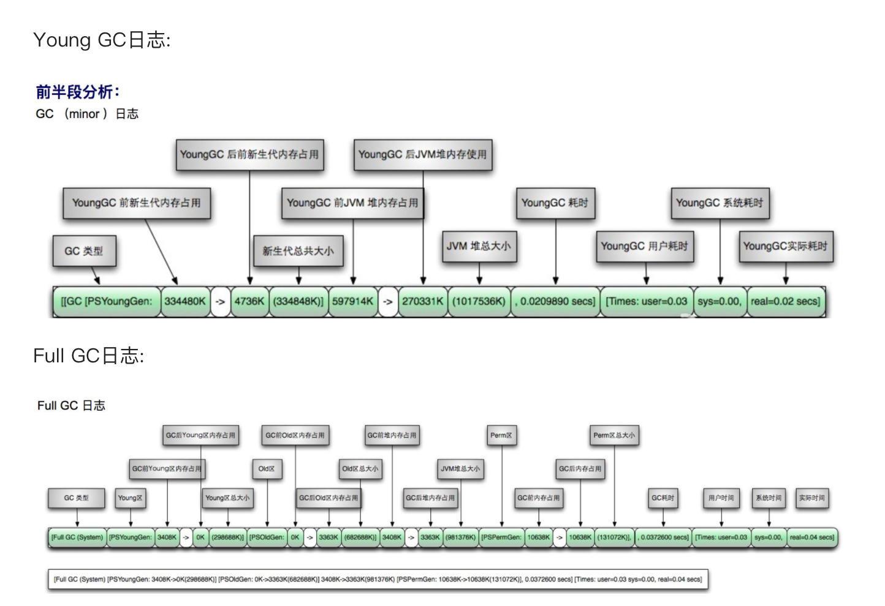

# JVM

## JVM 内存区域


## 垃圾回收与算法


## 垃圾回收器和使用的回收算法

- Serial 收集器（单线程复制算法）
- ParNew 收集器（多线程 + 复制算法）
- Parallel Scavenge 收集器（多线程 + 复制算法）
- Serial Old 收集器（单线程 + 标记整理算法）
- Parallel Old 收集器（多线程 + 标记整理算法）
- CMS 收集器（多线程 + 标记清除算法）
- G1 收集器（标记整理算法）


通过上图可以发现

1. Serial、ParNew、 Parallel Scavenge 是用来收集新生代的收集器
2. CMS、 Serial Old、Parallel Old 是用来收集老年代的收集器；然后 CMS 是不能和 Parallel Scavenge 结合起来用的，CMS 是可以和 Serial Old 联合起来收集老年代的。

## G1垃圾收集器有哪些优点？ 

1. `并行和并发`：可以充分利用多CPU、多核环境的优势，使用多个CPU缩短STW的时间，部分其他收集器原本需要停顿Java线程执行GC动作，G1收集器能够通过并发的方式让Java进程继续执行；
2. `分代收集`：不需要配合其他收集器进行GC，G1可以处理整个GC区域，采用不同的处理方式处理新生对象和经历多次GC的旧对象，以获得更好的回收效果；
3. `空间整合`：采用`标记整理算法`，从局部来看是复制算法实现，但是无论如何这两种算法都意味着G1收集器在运行期间不会产生垃圾碎片，收集后能够提供规整的可用内存，这种特性有利于系统长时间运行，不会因为大对象占用空间不足导致频繁GC；
4. `可以预测停顿时间`：G1的一大优势，降低STW时间是G1和CMS共同关注点，但是G1除了降低停顿时间外，还能建立可预测的停顿时间模型，能够让使用者指定一个长度为N毫秒的时间段，G1收集器将在该时间段内尽量回收更多的垃圾。

## 哪些可以作为GC ROOTS？

- `方法区中静态常量`引用的对象
- `方法区中静态属性`引用的对象
- `虚拟机栈中栈帧中局部变量表`引用的对象
- `本地方法栈中本地方法`引用的对象

## 什么时候需要加载类？

- 调用new、getstatic、putstatic 或 invokestatic 这4条指令，生成这4条指令的最常见的Java代码场景是：使用new关键字实例化对象的时候、读取或设置一个类的静态字段（被final修饰、已在编译期把结果放入常量池的静态字段除外）的时候，以及调用一个类的静态方法的时候；
- 使用反射包的方法对类进行调用的时候；
- 初始化某个类发现其父类未初始化；
- 虚拟机启动时，需要指定一个主类作为入口。

## 不会执行类初始化的情形

1. 通过子类引用父类的静态字段，只会触发父类的初始化，而不会触发子类的初始化。
2. 定义对象数组，不会触发该类的初始化。
3. 常量在编译期间会存入调用类的常量池中，本质上并没有直接引用定义常量的类，不会触
发定义常量所在的类。
4. 通过类名获取 Class 对象，不会触发类的初始化。
5. 通过 Class.forName() 加载指定类时，如果指定参数 initialize 为 false 时，也不会触发类初
始化，其实这个参数是告诉虚拟机，是否要对类进行初始化。
6. 通过 ClassLoader 默认的 loadClass 方法，也不会触发初始化动作。

## 如何排查CPU负载过高

1. top -c 查看所有进程；
2. 键入P 按照cpu的使用率从大到小排序；
3. 根据第2步拿到的pid 执行top -Hp pid 查看pid对应的线程cpu使用率；
4. 键入P 线程CPU的消耗从大到小排序； 
5. 选择第四步中最耗CPU的线程id；
6. 由于Linux中线程id的打印是10进制，将线程id转为16进制，printf “%x\n” tid；
7. 打印线程id对应的jstack日志 jstack pid │ grep tid -C 5 --color ：输出指定pid的线程jstack日志，过滤筛选指定的线程id，找到位置后前后打印5行 满足条件的tid字段线程颜色；
8. 根据堆栈线程找到对应的代码行。

## GC分析 命令调优

主要关注点：

- GC日志分析
- 调优命令
- 调优工具

### GC日志分析



### 调优命令和工具


Sun JDK监控和故障处理命令有`jps`、 `jstat`、 `jmap`、 `jhat`、 `jstack`、 `jinfo`

- `jps`，JVM Process Status Tool，显示指定系统内所有的HotSpot虚拟机进程。
- `jstat`，JVM statistics Monitoring是用于监视虚拟机运行时状态信息的命令，它可以显示出虚拟机进程中的类装载、内存、垃圾收集、JIT编译等运行数据。
- `jmap`，JVM Memory Map命令用于生成heap dump文件。
- `jhat`，JVM Heap Analysis Tool命令是与jmap搭配使用，用来分析jmap生成的dump，jhat内置了一个微型的HTTP/HTML服务器，生成dump的分析结果后，可以在浏览器中查看。
- `jstack`，用于生成java虚拟机当前时刻的线程快照。
- `jinfo`，JVM Configuration info 这个命令作用是实时查看和调整虚拟机运行参数。

### jstat命令

`jstat -gc pid 1000 100`

```properties
S0C：第一个幸存区的大小
S1C：第二个幸存区的大小
S0U：第一个幸存区的使用大小
S1U：第二个幸存区的使用大小
EC：伊甸园区的大小
EU：伊甸园区的使用大小
OC：老年代大小
OU：老年代使用大小
MC：方法区大小
MU：方法区使用大小
CCSC：压缩类空间大小
CCSU：压缩类空间使用大小
YGC：年轻代垃圾回收次数
YGCT：年轻代垃圾回收消耗时间
FGC：老年代垃圾回收次数
FGCT：老年代垃圾回收消耗时间
GCT：垃圾回收消耗总时间
```

### 调优工具

常用调优工具分为两类，jdk自带监控工具：`jconsole`和`jvisualvm`，第三方有：MAT(Memory Analyzer Tool)、GChisto。

- jconsole，Java Monitoring and Management Console是从java5开始，在JDK中自带的java监控和管理控制台，用于对JVM中内存，线程和类等的监控。
- jvisualvm，jdk自带全能工具，可以分析内存快照、线程快照；监控内存变化、GC变化等。
- MAT，Memory Analyzer Tool，一个基于Eclipse的内存分析工具，是一个快速、功能丰富的Java heap分析工具，它可以帮助我们查找内存泄漏和减少内存消耗。
- GChisto，一款专业分析gc日志的工具。

## OOM 问题排查的一些常用工具

**使用 MAT（Eclipse Memory Analyzer） 来分析 dump（堆转储快照） 文件**

步骤：

1. 运行 Java 时添加 「-XX:+HeapDumpOnOutOfMemoryError」 参数来导出内存溢出时的堆信息，生成 hrof 文件，添加 【-XX:HeapDumpPath】可以指定 hrof 文件的生成路径，如果不指定则 hrof 文件生成在与字节码文件相同的目录下；
2. 使用 MAT（Eclipse Memory Analyzer）来分析 hrof 文件，查出内存泄漏的原因。

## JVM 里 new 对象时，堆会发生什么吗？怎么去设计JVM的堆的线程安全

- 指针碰撞

假设JVM虚拟机上，每一次new 对象时，指针就会向右移动一个对象size的距离，一个线程正在给A对象分配内存，指针还没有来的及修改，另一个为B对象分配内存的线程，引用这之前的指针指向，这就发生了抢占，也被称为`指针碰撞`。

`TLAB`的实现是给每个线程分配私有的指针，存对象的内存空间还是给所有线程访问，其它线程无法在这个区域分配，保证堆的线程安全**Thread Local Allocation Buffer**，`线程本地分配缓存`；

JVM在内存新生代Eden Space中开辟了一小块线程私有的区域TLAB（Thread-local allocation buffer）。在Java程序中很多对象都是小对象且用过即丢，它们不存在线程共享也适合被快速GC，所以对于小对象通常JVM会优先分配在TLAB上，并且TLAB上的分配由于是线程私有，所以没有锁开销。

也就是说，**Java中每个线程都会有自己的缓冲区称作TLAB，在对象分配的时候不用锁住整个堆，而只需要在自己的缓冲区分配即可**。

## G1重要算法与总体流程

