# Java基础

## 日志框架

Logback、Log4j、Log4j2、commons-logging、JDK 自带的 java.util.logging 等，都是 Java 体系的日志框架，确实非常多。而不同的类库，还可能选择使用不同的日志框架。这样一来，日志的统一管理就变得非常困难。为了解决这个问题，就有了 SLF4J（Simple Logging Facade For Java），如下图所示：

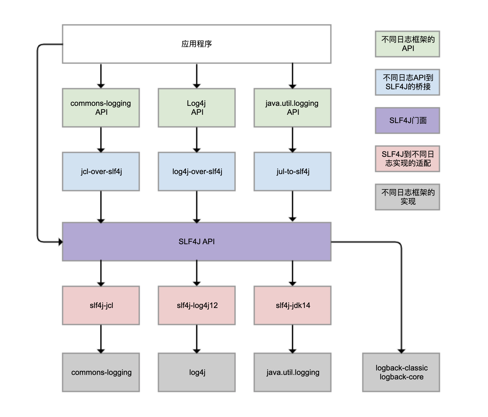


SLF4J 实现了三种功能：

- 一是`提供了统一的日志门面 API`，即图中紫色部分，实现了中立的日志记录 API。
- 二是`桥接功能`，即图中蓝色部分，用来把各种日志框架的 API（图中绿色部分）桥接到 SLF4J API。这样一来，即便你的程序中使用了各种日志 API 记录日志，最终都可以桥接到 SLF4J 门面 API。
- 三是`适配功能`，即图中红色部分，可以实现 SLF4J API 和实际日志框架（图中灰色部分）的绑定。SLF4J 只是日志标准，我们还是需要一个实际的日志框架。日志框架本身没有实现 SLF4J API，所以需要有一个前置转换。Logback 就是按照 SLF4J API 标准实现的，因此不需要绑定模块做转换。

## Java8日期时间类型

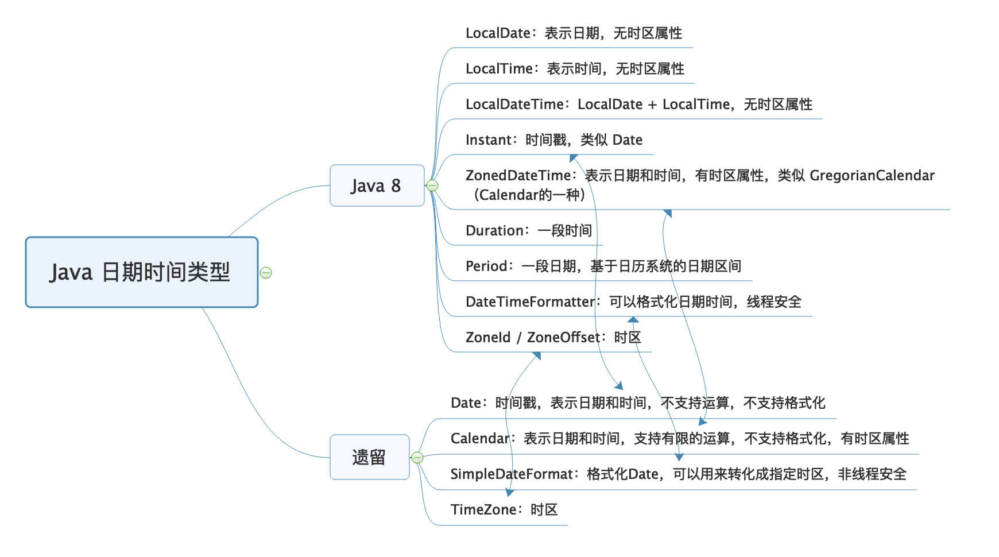

## JVM常量池

Jdk1.6及之前： 有永久代, 常量池在方法区

Jdk1.7：有永久代，但已经逐步“去永久代”，常量池在堆

Jdk1.8及之后： 无永久代，常量池在元空间

## [ CyclicBarrier和CountDownLatch区别](https://blog.csdn.net/tolcf/article/details/50925145)

| CountDownLatch                                               | CyclicBarrier                                                |
| ------------------------------------------------------------ | ------------------------------------------------------------ |
| 减计数方式                                                   | 加计数方式                                                   |
| 计算为0时释放所有等待的线程                                  | 计数达到指定值时释放所有等待线程                             |
| 计数为0时，无法重置                                          | 计数达到指定值时，计数置为0重新开始                          |
| 调用countDown()方法计数减一，调用await()方法只进行阻塞，对计数没任何影响 | 调用await()方法计数加1，若加1后的值不等于构造方法的值，则线程阻塞 |
| 不可重复利用                                                 | 可重复利用                                                   |
| 底层：AQS                                                    | 底层：ReentrantLock 和 Condition                             |

## 内存屏障

[内存屏障](https://www.jianshu.com/p/2ab5e3d7e510)

## Java内存模型

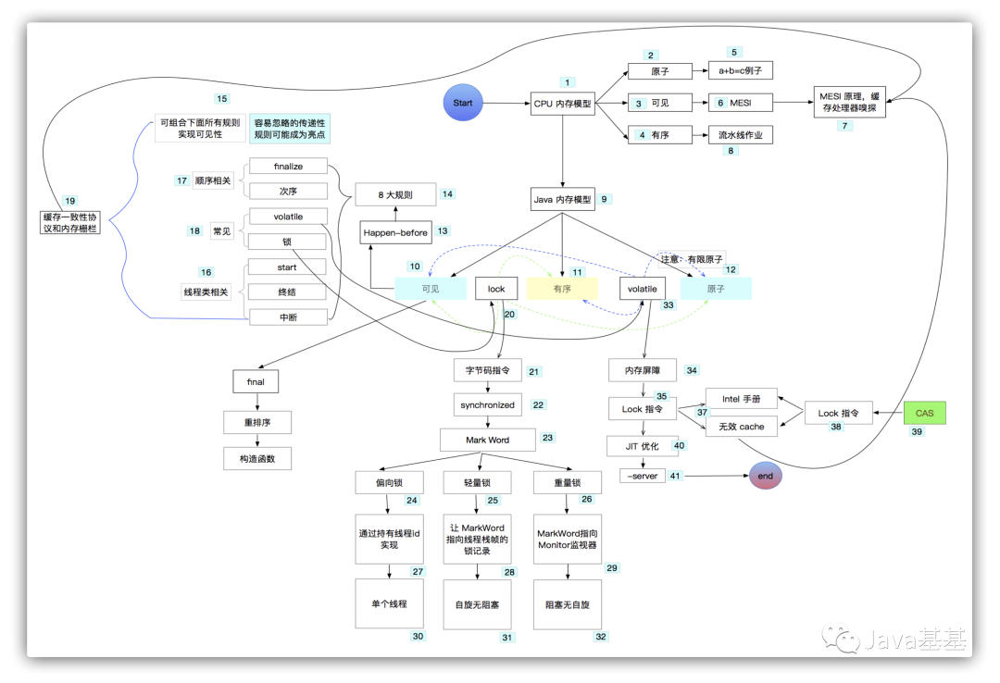

## 聊聊volatile

1. volatile修饰符适用于以下场景：某个属性被多个线程共享，其中有一个线程修改了此属性，其他线程可以立即得到修改后的值，比如boolean flag；或者作为触发器，实现轻量级同步。
2. volatile属性的**读写**操作都是无锁的，它不能替代synchronized，因为它没有提供原子性和互斥性。因为无锁，不需要花费时间在获取锁和释放锁上，所以说它是低成本的。
3. volatile只能作用于属性，我们用volatile修饰属性，这样compilers就不会对这个属性做指令重排序。
4. volatile提供了可见性，任何一个线程对其的修改将立马对其他线程可见，volatile属性不会被线程缓存，始终从主存中读取。
5. volatile提供了happens-before保证，对volatile变量的写入happens-before所有其他线程后续对它的读操作。
6. volatile可以使得long和double的赋值是原子的。
7. volatile可以在单例双重检查中实现可见性和禁止指令重排序，从而保证安全性。

## [volatile内存屏障](https://mp.weixin.qq.com/s/Oa3tcfAFO9IgsbE22C5TEg)

`内存屏障可以禁止指令重排序`


volatile写是在前面和后面**分别插入内存屏障**，而volatile读操作是在**后面插入两个内存屏障**。

从上图可以看出：

1. 当第二个操作是`volatile写`时，不管第一个操作是什么，都不能重排序。这个规则确保volatile写之前的操作不会被编译器重排序到volatile写之后。
2. 当第一个操作是`volatile读`时，不管第二个操作是什么，都不能重排序。这个规则确保volatile读之后的操作不会被编译器重排序到volatile读之前。
3. 当第一个操作是`volatile写`，第二个操作是`volatile读`时，不能重排序。

**写**

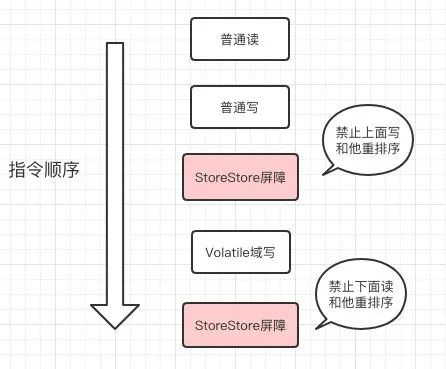

**读**

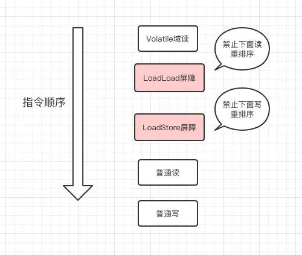

JMM内存屏障插入策略：

1. 在每个volatile写操作的前面插入一个StoreStore屏障。
2. 在每个volatile写操作的后面插入一个StoreLoad屏障。
3. 在每个volatile读操作的后面插入一个LoadLoad屏障。
4. 在每个volatile读操作的后面插入一个LoadStore屏障。

StoreStore屏障可以保证在volatile写之前，其前面的所有普通写操作都已经刷新到主内存中。 

StoreLoad屏障的作用是避免volatile写与后面可能有的volatile读/写操作重排序。 

LoadLoad屏障用来禁止处理器把上面的volatile读与下面的普通读重排序。 

LoadStore屏障用来禁止处理器把上面的volatile读与下面的普通写重排序。

## 总线风暴

由于volatile的MESI缓存一致性协议需要不断的从主内存嗅探和cas不断循环无效交互导致总线带宽达到峰值。
**解决办法：部分volatile和cas使用synchronize**

[关于指令重排内存屏障和总线风暴](https://blog.csdn.net/li12127878/article/details/101001128)

## [wait、sleep、yield区别](https://www.jianshu.com/p/eef770a588fb)

- sleep、yield方法是静态方法；作用的是`当前执行的线程`;
- yield方法释放了cpu的执行权，但是依然保留了cpu的执行资格。yield()做的是让当前运行线程回到可运行状态，以允许具有相同优先级的其他线程获得运行机会。因此，使用yield()的目的是**让相同优先级的线程之间能适当的轮转执行**。但是，实际中无法保证yield()达到让步目的，因为让步的线程还有可能被线程调度程序再次选中。

- wait释放CPU资源，同时释放锁；
- sleep释放CPU资源，但不释放锁；
- join()方法会使当前线程等待调用join()方法的线程结束后才能继续执行

## [Java动态代理机制的对比（JDK 和CGLIB，Javassist，ASM）](https://www.cnblogs.com/duanxz/p/3577682.html)

**Javassist和ASM之间的比较：**

- 与ASM中的实际字节码操作相比，Javassist源代码级API更易于使用。

- Javassist在复杂的字节码级操作上提供了更高级别的抽象层。Javassist源代码级API需要的实际字节码知识很少或根本不需要，因此实现起来更容易、更快。

- Javassist使用反射机制，这使得它比运行时使用类工作技术的ASM慢。

- 总体上，ASM比Javassist更快，性能更好。Javassist使用Java源代码的简化版本，然后将其编译成字节码。这使得javassist非常容易使用，但是它也将字节码的使用限制在javassist源代码的限制范围内。

## [Java Lambda表达式实现原理分析](https://blog.csdn.net/qq_37960603/article/details/85028867)

1. 在类编译时，会生成一个`私有静态方法` + 一个`内部类`。
2. 私有静态方法实现了 Lambda表达式的代码逻辑；
3. 在内部类中实现了函数式接口，在实现接口的方法中，会调用编译器生成的静态方法；
4. 在使用lambda表达式的地方，通过传递内部类实例，来调用函数式接口方法。

## AtomicInteger 类原理

AtomicInteger 类主要利用 `CAS (compare and swap) + volatile 和 native 方法`来保证原子操作，从而避免 synchronized 的高开销，执行效率大为提升。

## StampedLock原理

`StampedLock`通过将 state 按位切分的方式表示不同的锁状态。

**悲观读锁**：state 的 0-7 位表示获取读锁的线程数，如果超过 0-7 位的最大容量 126，则使用一个名为 readerOverflow 的 int 整型保存超出数。

**写锁**：state 第 8 位为写锁标志，0 表示未被占用，1 表示写锁被占用。state 第 8-64 位表示写锁的获取次数，次数超过 64 位最大容量则重新从 1 开始

## 逃逸分析

JVM判断新创建的对象逃逸的依据有：

- 对象被赋值给堆中对象的字段和类的静态变量。
- 对象被传进了不确定的代码中去运行。

## 逃逸分析总结

一、是JVM优化技术，它不是直接优化手段，而是为其它优化手段提供依据。

二、逃逸分析主要就是分析对象的动态作用域。

三、逃逸有两种：`方法逃逸`和`线程逃逸`。

1. 方法逃逸：对象逃出当前方法

   当一个对象在方法里面被定义后，它可能被外部方法所引用，例如作为调用参数传递到其它方法中。

2. **线程逃逸**：对象逃出当前线程

   这个对象甚至可能被其它线程访问到，例如赋值给类变量或可以在其它线程中访问的实例变量

四、如果不存在逃逸，则可以对这个变量进行优化
- **栈上分配**
  在一般应用中，不会逃逸的局部对象占比很大，如果使用栈上分配，那大量对象会随着方法结束而自动销毁，垃圾回收系统压力就小很多。

- **同步消除**
  线程同步本身比较耗时，如果确定一个变量不会逃逸出线程，无法被其它线程访问到，那这个变量的读写就不会存在竞争，对这个变量的同步措施可以清除

- **标量替换**

   1. 标量就是不可分割的量，java中基本数据类型，reference类型都是标量。相对的一个数据可以继续分解，它就是聚合量（aggregate）。
   2. 如果把一个对象拆散，将其成员变量恢复到基本类型来访问就叫做标量替换。
   3. 如果逃逸分析证明一个对象不会被外部访问，并且这个对象可以被拆散的话，那么程序真正执行的时候将可能不创建这个对象，而改为直接在>栈上创建若干个成员变量。

五、逃逸分析还不成熟。

1. 不能保证逃逸分析的性能收益必定高于它的消耗。
   
     判断一个对象是否逃逸耗时长，如果分析完发现没有几个不逃逸的对象，那时间就白白浪费了。

   2. 基于逃逸分析的优化手段不成熟，如上面提到的栈上分配，由于hotspot目前的实现方式导致栈上分配实现起来复杂。

六、逃逸分析相关JVM参数
        -XX:+DoEscapeAnalysis 开启逃逸分析

		-XX:+PrintEscapeAnalysis 开启逃逸分析后，可通过此参数查看分析结果
	
		-XX:+EliminateAllocations 开启标量替换
	
		-XX:+EliminateLocks 开启同步消除
	
		-XX:+PrintEliminateAllocations 开启标量替换后，查看标量替换情况

## 基于逃逸分析的优化

当判断出对象不发生逃逸时，编译器可以使用逃逸分析的结果作一些代码优化

- **将堆分配转化为栈分配**。如果某个对象在子程序中被分配，并且指向该对象的指针永远不会逃逸，该对象就可以在分配在栈上，而不是在堆上。在有垃圾收集的语言中，这种优化可以降低垃圾收集器运行的频率。
- **同步消除**。如果发现某个对象只能从一个线程可访问，那么在这个对象上的操作可以不需要同步。
- **分离对象或标量替换**。如果某个对象的访问方式不要求该对象是一个连续的内存结构，那么对象的部分（或全部）可以不存储在内存，而是存储在CPU寄存器中。

## 虚引用的作用

在于跟踪垃圾回收过程，在对象被收集器回收时收到一个系统通知。 当垃圾回收器准备回收一个对象时，如果发现它还有虚引用，就会在垃圾回收后，将这个虚引用加入引用队列，在其关联的虚引用出队前，不会彻底销毁该对象。 所以可以通过检查引用队列中是否有相应的虚引用来判断对象是否已经被回收了。

```properties
与软引用和弱引用不同, 虚引用不会被 GC 自动清除, 因为他们被存放到队列中. 通过虚引用可达的对象会继续留在内存中, 直到调用此引用的 clear 方法, 或者引用自身变为不可达
```

也就是说，我们必须手动调用 clear() 来清除虚引用, 否则可能会造成 OutOfMemoryError 而导致 JVM 挂掉. 使用虚引用的理由是, 对于用编程手段来跟踪某个对象何时变为不可达对象, 这是唯一的常规手段。 和软引用/弱引用不同的是, 我们不能复活虚可达(phantom-reachable)对象。

## Java中的锁

参考文章：[不可不说的Java“锁”事](https://tech.meituan.com/2018/11/15/java-lock.html)


## synchronized 锁优化

jdk1.6中对 synchronized进行了大量的优化，包括自旋锁、适应性自旋锁、锁粗化、锁消除、偏向锁、轻量级锁等锁技术来减少锁操作的开销。锁主要存在四种状态中：无锁状态、偏向锁状态、轻量级锁状态、重量级锁状态，它们会随着锁的竞争的激烈逐渐升级，这个过程是单向不可逆的，主要是为了提高锁的释放和获取的效率。

## synchronized四种锁状态对应的的Mark Word内容

| 锁状态   | 存储内容                                                | 存储内容 |
| :------- | :------------------------------------------------------ | :------- |
| 无锁     | 对象的hashCode、对象分代年龄、是否是偏向锁（0）         | 01       |
| 偏向锁   | 偏向线程ID、偏向时间戳、对象分代年龄、是否是偏向锁（1） | 01       |
| 轻量级锁 | 指向栈中锁记录的指针                                    | 00       |
| 重量级锁 | 指向互斥量（重量级锁）的指针                            | 10       |

**自旋锁**

线程的阻塞和唤醒需要 CPU 由用户状态转换为核心状态，频繁的阻塞和唤醒对CPU来说是一种负担，势必会给系统的并发性带来压力。同时发现在许多应用上面，锁的状态只是持续很短的一段时间，为了这一段很短的时间频繁的阻塞和唤醒线程是很得不偿失的一件事，所以，引入了自旋锁。

> 所谓的自旋锁，就是让线程等待一段时间，不会被立即挂起，执行一段无意义的循环，看持有锁的线程是否会释放锁，如果释放锁，这时候自旋锁可以马上获取同步资源。

相关JVM参数：

> -XX:+UseSpinning 开启自旋锁
>
> -XX:PreBlockSpin=10 设置自旋锁次数，默认 10 次

**适应性自旋锁**

> 自旋的次数不再固定，根据前一次在同一锁的自旋时间和锁拥有者的状态来决定。线程如果自选成功了，那么下次自选的次数就会增加

**锁消除**

> 在不存在线程竞争的场景，JVM 通过逃逸分析检测不会存在共享数据竞争，JVM 就会对这些同步锁进行消除。

**锁粗化**

> 将多个连续加锁、解锁的操作连接在一起，扩大加锁的范围。

**无锁**

> 无锁就是没有对资源进行锁定，所有的线程都能访问并修改同一个资源，但同时只有一个线程能修改成功。

无锁的特点就是修改操作在循环内进行，线程会不断的尝试修改共享资源。如果没有冲突就修改成功并退出，否则就会继续循环尝试。如果有多个线程修改同一个值，必定会有一个线程能修改成功，而其他修改失败的线程会不断重试直到修改成功。**无锁无法全面代替有锁，但无锁在某些场合下的性能是非常高的。**

**偏向锁**

> 偏向锁是指一段同步代码一直被一个线程所访问，那么该线程会自动获取锁，降低获取锁的代价。
>
> -XX:-UseBiasedLocking=false 关闭偏向锁

在大多数情况下，锁总是由同一线程多次获得，不存在多线程竞争，所以出现了偏向锁。其目标就是在只有一个线程执行同步代码块时能够提高性能。

当一个线程访问同步代码块并获取锁时，会在Mark Word里存储锁偏向的线程ID。在线程进入和退出同步块时不再通过CAS操作来加锁和解锁，而是检测Mark Word里是否存储着指向当前线程的偏向锁。引入偏向锁是为了在无多线程竞争的情况下尽量减少不必要的轻量级锁执行路径，因为轻量级锁的获取及释放依赖多次CAS原子指令，而偏向锁只需要在置换ThreadID的时候依赖一次CAS原子指令即可。

偏向锁只有遇到其他线程尝试竞争偏向锁时，持有偏向锁的线程才会释放锁，线程不会主动释放偏向锁。偏向锁的撤销，需要等待全局安全点（在这个时间点上没有字节码正在执行），它会首先暂停拥有偏向锁的线程，判断锁对象是否处于被锁定状态。撤销偏向锁后恢复到无锁（标志位为“01”）或轻量级锁（标志位为“00”）的状态。

偏向锁在JDK 6及以后的JVM里是默认启用的。可以通过JVM参数关闭偏向锁：`-XX:-UseBiasedLocking=false`，关闭之后程序默认会进入轻量级锁状态。

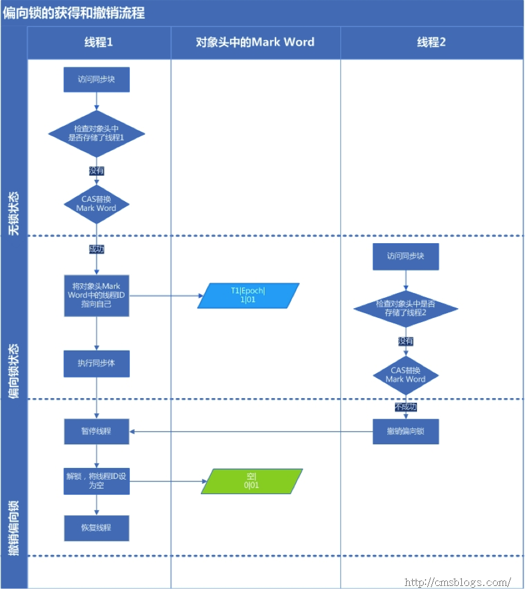

**轻量级锁**

> 指当锁是偏向锁的时候，被另外的线程所访问，偏向锁就会升级为轻量级锁，其他线程会通过自旋的形式尝试获取锁，不会阻塞，从而提高性能。

在代码进入同步块的时候，如果同步对象锁状态为无锁状态（锁标志位为“01”状态，是否为偏向锁为“0”），虚拟机首先将在当前线程的栈帧中建立一个名为**锁记录（Lock Record）**的空间，用于存储锁对象目前的Mark Word的拷贝，然后拷贝对象头中的Mark Word复制到锁记录中。

拷贝成功后，虚拟机将使用CAS操作尝试将对象的Mark Word更新为指向Lock Record的指针，并将Lock Record里的owner指针指向对象的Mark Word。

如果这个更新动作成功了，那么这个线程就拥有了该对象的锁，并且对象Mark Word的锁标志位设置为“00”，表示此对象处于轻量级锁定状态。

如果轻量级锁的更新操作失败了，虚拟机首先会检查对象的Mark Word是否指向当前线程的栈帧，如果是就说明当前线程已经拥有了这个对象的锁，那就可以直接进入同步块继续执行，否则说明多个线程竞争锁。

若当前只有一个等待线程，则该线程通过自旋进行等待。但是当自旋超过一定的次数，或者一个线程在持有锁，一个在自旋，又有第三个来访时，轻量级锁升级为重量级锁。

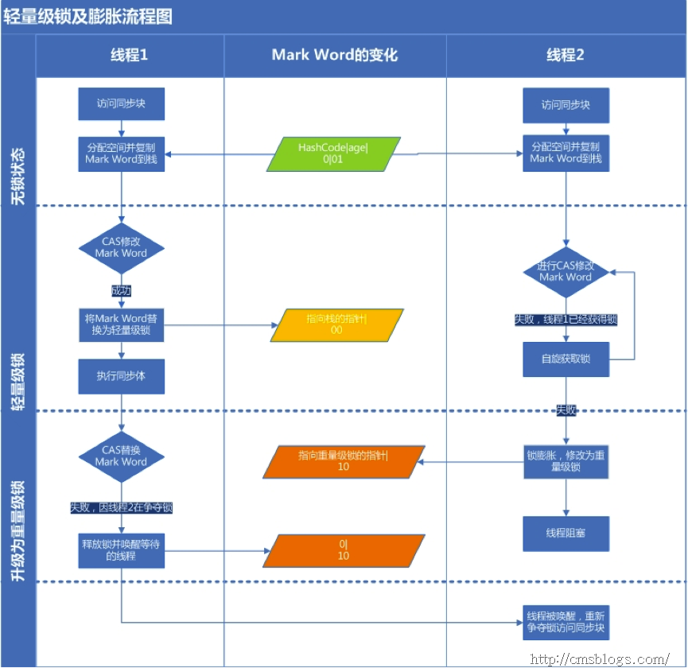

**重量级锁**

升级为重量级锁时，锁标志的状态值变为“10”，此时Mark Word中存储的是指向重量级锁的指针，此时等待锁的线程都会进入阻塞状态。

整体的锁状态升级流程如下：


综上，偏向锁通过对比Mark Word解决加锁问题，避免执行CAS操作。而轻量级锁是通过用CAS操作和自旋来解决加锁问题，避免线程阻塞和唤醒而影响性能。重量级锁是将除了拥有锁的线程以外的线程都阻塞。

## 独享锁 VS 共享锁

**ReentrantLock和ReentrantReadWriteLock**
在一个整型变量state上分别描述读锁和写锁的数量（或者也可以叫状态）。于是将state变量“按位切割”切分成了两个部分，高16位表示读锁状态（读锁个数），低16位表示写锁状态（写锁个数）


## Java对象组成

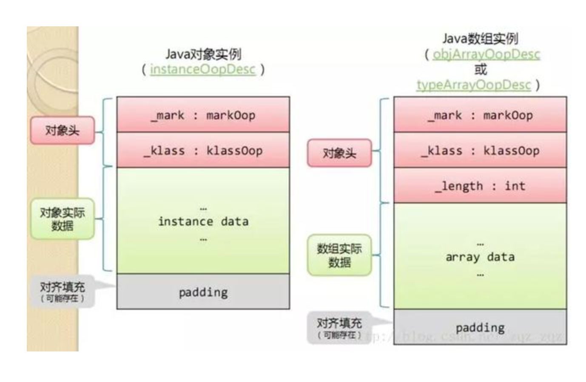

### 对象头

HotSpot虚拟机的对象头包括两部分信息：`Mark Word`和`Klass Pointer`

#### Mark Word

第一部分Mark Word，用于存储对象自身的运行时数据，如哈希码（HashCode）、GC分代年龄、锁状态标志、线程持有的锁、偏向线程ID、偏向时间戳等，这部分数据的长度在32位和64位的虚拟机（未开启压缩指针）中分别为32bit和64bit，官方称它为“Mark Word”。

#### Klass Pointer

对象头的另外一部分是klass类型指针，即对象指向它的类元数据的指针，虚拟机通过这个指针来确定这个对象是哪个类的实例.

数组长度（只有数组对象有）

如果对象是一个数组, 那在对象头中还必须有一块数据用于记录数组长度.

### 实例数据

实例数据部分是对象真正存储的有效信息，也是在程序代码中所定义的各种类型的字段内容。无论是从父类继承下来的，还是在子类中定义的，都需要记录起来。

### 对齐填充

第三部分对齐填充并不是必然存在的，也没有特别的含义，它仅仅起着占位符的作用。由于HotSpot VM的自动内存管理系统要求**对象起始地址必须是8字节的整数倍**，换句话说，就是对象的大小必须是8字节的整数倍。而对象头部分正好是8字节的倍数（1倍或者2倍），因此，当对象实例数据部分没有对齐时，就需要通过对齐填充来补全。

其中的klass类型指针就是那条红色的联系，那是怎么联系的呢？

```java
new Thread().start();
```

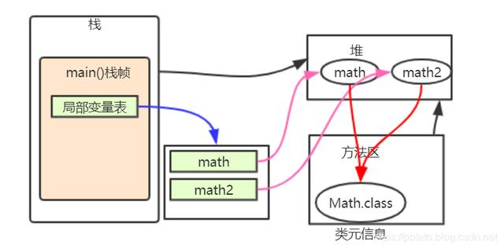

类加载其实最终是以类元信息的形式存储在方法区中的，math和math2都是由同一个类new出来的，当对象被new时，都会在对象头中存储一个指向类元信息的指针，这就是Klass Pointer.

## java反射机制中class.forName和classloader的区别

（1）class.forName()除了将类的.class文件加载到jvm中之外，还会对类进行解释，执行类中的static块。当然还可以指定是否执行静态块。

（2）classLoader只干一件事情，就是将.class文件加载到jvm中，不会执行static中的内容，只有在newInstance才会去执行static块。

## Java类加载过程

1. 加载
简单的说，类加载阶段就是由类加载器负责根据一个类的全限定名来读取此类的二进制字节流到JVM内部，并存储在运行时数据区的方法区，然后将其转换为一个与目标类型对应的java.lang.Class对象实例（Java虚拟机规范并没有明确要求一定要存储在堆区中，只是hotspot选择将Class对象存储在方法区中），这个Class对象在日后就会作为方法区中该类的各种数据的访问入口。

2. 链接
    链接阶段要做的是将加载到JVM中的二进制字节流的类数据信息合并到JVM的运行时状态中，经由`验证`、`准备`和`解析`三个阶段。
    
      ① **验证**
    
    **验证类数据信息是否符合JVM规范**，是否是一个有效的字节码文件，验证内容涵盖了类数据信息的格式验证、语义分析、操作验证等。
    
    格式验证：验证是否符合class文件规范；
    
    语义验证：检查一个被标记为final的类型是否包含子类；检查一个类中的final方法视频被子类进行重写；确保父类和子类之间没有不兼容的一些方法声明（比如方法签名相同，但方法的返回值不同）；
    
    操作验证：在操作数栈中的数据必须进行正确的操作，对常量池中的各种符号引用执行验证（通常在解析阶段执行，检查是否通过富豪引用中描述的全限定名定位到指定类型上，以及类成员信息的访问修饰符是否允许访问等）
    
      ② **准备**
    
    **为类中的所有静态变量分配内存空间**，并为其设置一个初始值（由于还没有产生对象，实例变量不在此操作范围内）被final修饰的静态变量，会直接赋予原值；类字段的字段属性表中存在ConstantValue属性，则在准备阶段，其值就是ConstantValue的值；
    
      ③ **解析**
    
    **将常量池中的符号引用转为直接引用**（得到类或者字段、方法在内存中的指针或者偏移量，以便直接调用该方法），这个可以在初始化之后再执行。可以认为是一些静态绑定的会被解析，动态绑定则只会在运行是进行解析；静态绑定包括一些final方法(不可以重写)，static方法(只会属于当前类)，构造器(不会被重写)
    
3. 初始化

    将一个类中所有被static关键字标识的代码统一执行一遍，如果执行的是静态变量，那么就会使用用户指定的值覆盖之前在准备阶段设置的初始值；如果执行的是static代码块，那么在初始化阶段，JVM就会执行static代码块中定义的所有操作。

所有类变量初始化语句和静态代码块都会在编译时被前端编译器放在收集器里头，存放到一个特殊的方法中，这个方法就是方法，即类/接口初始化方法。该方法的作用就是初始化一个中的变量，使用用户指定的值覆盖之前在准备阶段里设定的初始值。任何invoke之类的字节码都无法调用方法，因为该方法只能在类加载的过程中由JVM调用。

如果父类还没有被初始化，那么优先对父类初始化，但在方法内部不会显示调用父类的方法，由JVM负责保证一个类的方法执行之前，它的父类方法已经被执行。
JVM必须确保一个类在初始化的过程中，如果是多线程需要同时初始化它，仅仅只能允许其中一个线程对其执行初始化操作，其余线程必须等待，只有在活动线程执行完对类的初始化操作之后，才会通知正在等待的其他线程。

## HashMap 数据结构

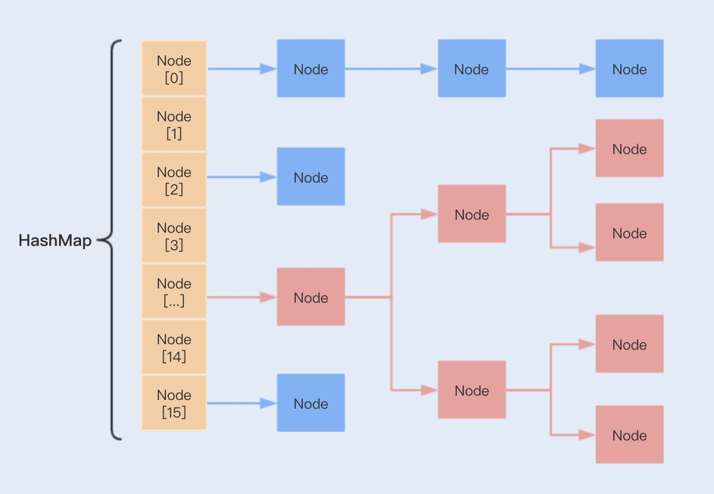

## HashMap的 put 流程

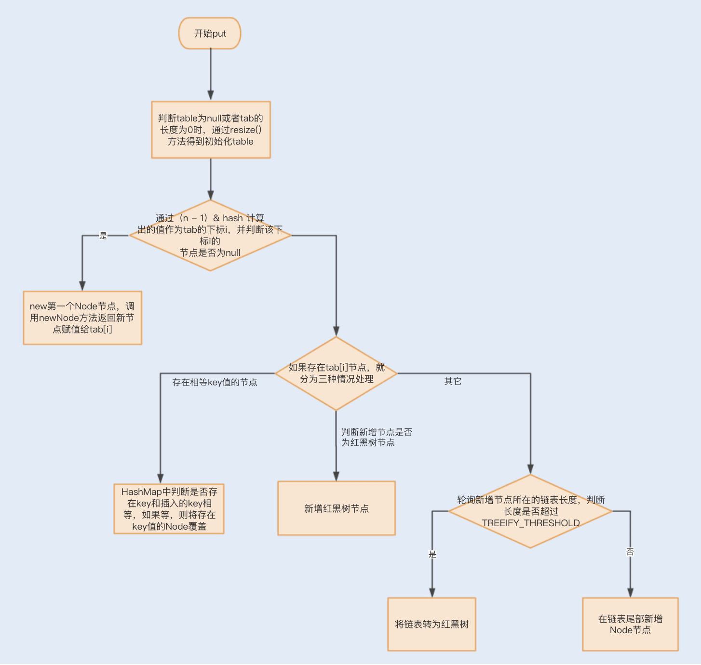

## 说一下数组和链表的底层实现

1. 数组底层实现就是起始地址值和寻址算法：`起始地址值 + 数组下标 * 元素对应的字节数`，数组进行查询时通过寻址算法一次可以定位到地址值 
2. 链表底层实现，每个链表会存储下一个元素对应的地址值，这样进行增或者删时通过链表引用链O(1)操作即可

## 说下CurrentHashMap吧，1.7和1.8有什么区别，了解红黑树吗?1.8为什么这么用红黑树

**区别**

|                | JDK 1.7                                                      | JDK 1.8                                                      |
| -------------- | ------------------------------------------------------------ | ------------------------------------------------------------ |
| 数据结构       | segment数组 + HashEntry数组 + 链表                           | Node数组 + 链表 + 红黑树                                     |
| 锁方式         | ReentrantLock                                                | synchronized + cas                                           |
| 扩容方式       | 头插，重点**死循环**                                         | 尾插法                                                       |
| hash方式       | hash & (len - 1)                                             | hash高位运算                                                 |
| size计算方法   | 先采用不加锁的方式计算两次，如果前后两次计算结果相同，说明计算结果是准确的；<br />如果计算结果不同，则采用加锁的方式计算第三次 | 使用volatile类型的变量baseCount记录元素的个数，如果有元素变动，则通过addCount()更新baseCount值，最后通过baseCount和遍历CountCell数组的元素进行累加计算 |
| 查找时间复杂度 | O(N)                                                         | O(lgN)                                                       |

## 为什么不使用AVL树而使用红黑树？

红黑树和AVL树都是**最常用的平衡二叉搜索树**，它们的查找、删除、修改都是O(lgn) time

AVL树和红黑树有几点比较和区别：

1. AVL树是更加严格的平衡，因此可以提供更快的查找速度，一般读取查找密集型任务，适用AVL树。红黑树更适合于插入修改密集型任务。
2. 通常，AVL树的旋转比红黑树的旋转更加难以平衡和调试。

**总结**：

1. AVL以及红黑树是高度平衡的树数据结构。它们非常相似，**真正的区别在于在任何添加/删除操作时完成的旋转操作次数。**
2. 两种实现都缩放为a O(lg N)，其中N是叶子的数量，但实际上AVL树在查找密集型任务上更快：利用更好的平衡，树遍历平均更短。另一方面，插入和删除方面，AVL树速度较慢：需要更高的旋转次数才能在修改时正确地重新平衡数据结构。
3. 在AVL树中，从根到任何叶子的最短路径和最长路径之间的差异最多为1。在红黑树中，差异可以是2倍。
4. 两个都给O（log n）查找，但平衡AVL树可能需要O（log n）旋转，而红黑树将需要最多两次旋转使其达到平衡（尽管可能需要检查O（log n）节点以确定旋转的位置）。旋转本身是O（1）操作，因为你只是移动指针。

## synchronized可见性在硬件级别的分析

硬件方面：处理器，寄存器，写缓冲器，高速缓存。 

`写的过程` ：处理器在计算完某个变量以后，可能将计算后的值写到以上各个硬件中去，如果该变量加了volatile，就会走MESI缓存一致性协议，将该变量更改的消息发送到总线bus中，接着再把最新的计算值**flush**到高速缓存或主存中（硬件实现差异），这个操作叫做`flush`。

`读的过程`：在其他处理器在需要用到该变量的时候，就会嗅探到该变量的更改，就会到更改了该变量的高速缓存或者主存中去加载最新的变量值，从而保证用来计算的值是最新的，这个操作叫做`refresh`。

## 高速缓存的数据结构：拉链散列表，缓存条目和地址解码

1. 高速缓存的底层数据结构是一个`拉链散列表`，也就是多个bucket；
2. 每个`bucket`挂了很多的`cache entry`，由`tag`（对应主存中的地址），`cache line`(缓存行)，`flag`（缓存行状态）组成；
3. 在处理器对高速缓存进行读写的时候，会通过变量名执行一个内存地址解码的操作，解码出三个东西：`index`（哪个bucket）、`tag`（定位到bucket中具体的一个cacke entry）、`offset`（找到在cache entry中cache line的相对位置）； 
4. 如果处理器从高速缓存中读不到对应的数据，就会去主存或者其他处理器的高速缓存中读取放到高速缓存中；
5. 高速缓存是分层的，L1、L2、L3越靠前的读写速度越快。

## 结合硬件级别的缓存数据结构深入分析缓存一致性协议

整个MESI协议运作过程：

1. 存在一个变量x=0，在所有处理器中都不存在，处理器1需要用到的时候，由总线去加载完放到对应的cache entry中，此时状态是**S**。 
2. 处理器2也需要读取该值，像总线发请求，然后总线从处理器1的高速缓存或者主存中取得最新的变量值返回给处理器2，此时处理器2中的变量状态也是**S**。 
3. 此时处理器1需要执行修改，因此向总线发送失效`invalidate`的消息，等待所有处理器回复ack后，对自己高速缓存中的变量进行加独占锁，此时处理器1中的变量状态是**E**，而处理器2的变量状态是**I**。 
4. 最后处理器1计算完后，写回高速缓存中，释放掉独占锁，将变量状态修改为**M**。 
5. 处理器2在需要计算的时候流程同上。

## 采用写缓冲器和无效队列优化MESI协议的实现性能

1. **M**是修改状态、**E**是独占状态也就是加锁、**S**是共享状态、**I**是无效状态
2. 引入写缓冲器和无效队列两个组件去提高MESI的执行效率。 
3. 写缓冲器：为了减少失效确认的同步等待时间，处理器在对一个变量进行失效->独占->修改的操作会变成：将修改的后的值直接写到写缓冲器，然后向主线发送失效消息，就认为写成功了。在写缓存器收到全部的ack后，处理器再去对高速缓存进行**独占**和**修改**的操作。 
4. 无效队列：同样是为了提高处理器的利用率，将收到的失效请求先放进一个无效队列，收到后就直接返回ack，最后自己慢慢消费无效队列的请求去将高速缓存中的数据失效掉。

## 内存屏障在硬件层面的实现原理以及如何解决各种问题

1. 通过store屏障来保证，处理器对数据的写入发送invalidate消息给总线后一定会等待invalidate ack后才能去获取锁修改数据，也就是不能直接写入到写缓冲器后认为ack了，保证写数据可见性 ;
2. load屏障：保证读数据的时候一定会将无效队列中的`invalidate`消息写入到高速缓冲区中保证读数据的可见性 ;
3. storestore屏障来保证写1一定在写2之前发生，来保证store store重排的有序性;
4. 同理storeload屏障保证store load重排问题

## 如何从内存屏障、硬件层面的原理来震慑面试官

1. 首先硬盘和内存的发展速度远不及cpu的发展速度，而要保证cpu的高速运行就对cpu增加一个**高速缓存**。但是增加高速缓存以后这就导致了各个cpu之间内的高速缓存造成数据不一致的现象
2. 为了解决这种数据不一致的现象就提出了**MESI协议**，通过修改各个高速缓存中数据的状态来保证数据一致性的问题。M是修改状态、E是独占状态也就是加锁、S是共享状态、I是无效状态。 
3. 虽然通过MESI可以保证数据的一致性，但是却会大大的影响cpu的处理速度，因为cpu在修改一个处于S状态的数据时，首先会对总线发出一条invalid的通知，告诉所有其他的cpu(持有该数据)数据失效，然后等到接受到其他cpu的invalid ack消息才会对这条数据进行修改，**等待ack这个时候其实是阻塞的**，cpu只有等待所有ack返回之后才会执行其他的指令，而相对于cpu修改数据而言，等待ack消息的耗时是特别长的，这就体现出了cpu性能下降这个问题。 
4. 为了解决这个问题，就又对cpu内增加**写缓存**和**失效队列**这两个概念，cpu要写一个数据的时候首先发送invalid指令，然后把接收ack这个工作交给写缓存器，然后cpu自己去执行其他的指令。其他的cpu收到invalid消息之后直接把invalid消息扔到失效队列中，然后返回invalid ack消息，这样cpu就不用因为等待ack指令而降低处理速度。 
5. 但是这种情况又会引发**可见性和有序性**的问题，被扔到写缓存里的数据不会保证什么时候完成，这就可能cpu顺序写入指令1、指令2，将他们扔到写缓存中，但是指令2先执行完成，而其他线程先看到该线程的执行顺序为指令2、指令1，这是有序性的问题。可见性也就不用说了，要修改的数据还在写缓存中等着没执行呢。 
6. 为了解决这种可见性和有序性的问题就引入了**内存屏障**的概念，在修改一个数据之后强制cpu执行完写缓存中关于该变量的指令。在读取一个数据之前强制执行时效队列中对该数据时效的指令，然后从其他高速缓存或者主内存中读取最新数据。

## Java程序运行过程中发生指令重排的几个地方

1. 指令重排有好几个层面都可能发生，从`静态编译`，`JIT编译`，再到处理器运算完后的`结果输出`等等。 
2. 指令重排也会遵守一些规则，例如两条互不相关的赋值语句，还有happen-before等等。 
3. 指令重排在单线程运行的情况下没有什么影响，但是在多线程的场景下会存在一些问题。

## synchronized是如何使用内存屏障保证原子性、可见性和有序性的

1. 原子性：加锁和释放锁，ObjectMonitor
2. 可见性：加**load**屏障和**store**屏障，释放锁**flush**数据，加锁**refresh**数据
3. 有序性：**acquire**屏障和**release**屏障，保证同步代码块内部的指令可以重排序，但是同步代码块内部的指令和外部的指令不能重排的

## 讲讲synchronized和ReentrantLock的原理和区别

[**synchronized**加锁的原理](https://www.jianshu.com/p/435c20a64da1)是通过monitorenter和monitorexit指令，具体来说是这样的，JVM中每个对象都有三部分组成：对象头、实例变量和填充数据，对象头是synchronized实现锁的基础，对象头包含两部分内容，分别为`mark word`和`class metadata address`，其中Markword中存放着指向monitor的指针，**Mark Word**：默认存储对象的HashCode，分代年龄和锁标志位信息。monitor对象是由C++实现的，叫ObjectMonitor。

ObjectMonitor中有几个关键属性：

- _owner：指向持有ObjectMonitor对象的线程
- _WaitSet：存放处于wait状态的线程队列
- _EntryList：存放处于等待锁block状态的线程队列
- _recursions：锁的重入次数
- _count：用来记录该线程获取锁的次数

**获取锁：** 当多个线程访问同一段代码块时，进入entryList，当某个线程首先获取到对象的monitor后，进入Owner区域，并把owner变量设置为当前线程，同时monitor的计数器count + 1，这样就表示该线程获取到锁。

**释放锁：** 获取锁的线程调用wait()方法则会释放monitor，count变量值减1，owner设置为null，线程进入waitSet区域，waitSet集合的线程是无序的，这也就解释了为什么调用notify()方法无法唤醒指定的线程，需要调用notifyAll()方法唤醒所有wait()的线程参与锁竞争。

## AQS

## 总结

1. 构建锁和同步器的框架，各种 Lock 包中的锁 ReentrantLock、ReentrantReadWriteLock、CountDownLatch、Semaphore；
2. volatile变量 state 表示同步状态，初始值为 0，有线程获取到锁 state + 1，解锁则 state - 1，直到 state = 0时其他线程才可以获取锁；
3. 内部维护了双向链表的队列，维护获取锁的排队工作，失败则加入到队列末尾，队列的每个节点通过 Node 封装了线程本身和状态，thread/ waitStatus：CANCELLED(1)、SIGNAL(-1)、CONDITION(-2)、PROPAGATE(-3)，封装了指向前驱节点和后继节点的引用pre和 next，方便线程释放后唤醒下一个等待的线程；
4. **AQS通过 Node 节点构建了双端链表CLH的同步队列，通过 ConditionObject 构建等待队列**。

### AQS执行流程

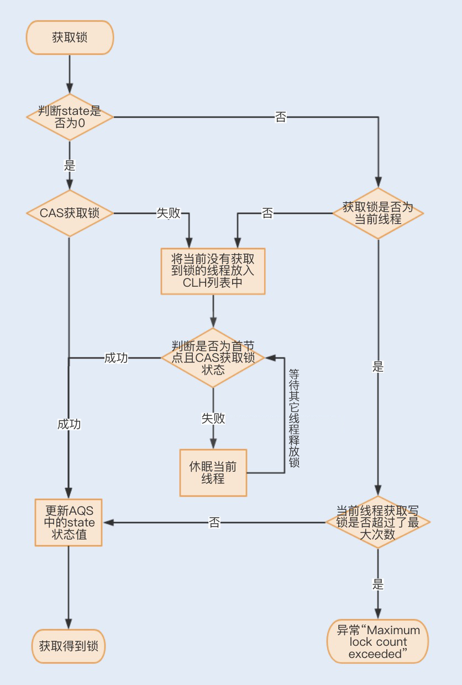

## Java虚拟机对synchronized锁的优化：锁消除、锁粗化、偏向锁、自旋锁

1. 锁消除：**JIT编译器**通过**逃逸分析**等技术发现有些被加锁的代码不会出现线程安全问题，那么动态编译的时候就会消除掉这个加锁的操作。（一般是有些框架里面自己加的synchronized而我们作为程序员并不知道，主要是优化这个） 
2. 锁粗化：多个同步块合并在一起去执行。 
3. 偏向锁：偏向于第一个加锁的线程，下一次这个线程再来加锁就不用加锁了，提升性能。但是仅仅适用于非常低的并发场景，因为一旦有第二个线程去尝试加锁，原本偏向的那个线程会被挂起来释放锁，偏向锁也就失效了，升级为轻量级锁。 
4. 轻量级锁：主要是基于对象头里面的mark word进行cas，防止每一次加锁都用到os互斥量的重量级锁。这个也仅仅适用于只有少量并发的情况，**轻量级锁所适应的场景是线程交替执行同步块的场合**，因为一旦第二个线程加锁失败，进入自旋，仍然失败，就会升级到重量级锁。 
5. 自旋锁：为了尽量少使用os的互斥量所做的最后努力（如果重量级锁竞争失败了，会进入自适应自旋），如果自旋也失败了，就会被挂起导致上下文切换。 
6. 重量级锁：就是直接使用OS互斥量来进行加锁操作的一种锁，涉及到内核态和用户态的相互转换。

## 说下对ThreadLocal认知，项目中的应用场景

**作用**：ThreadLocal主要是**为了解决多线程环境下对局部变量并发访问的冲突问题**，它为每个线程提供了独立的变量副本，使每个线程对变量的操作实现线程隔离，互不干扰，它比直接使用synchronized实现同步机制的方式来实现线程安全更加简单方便。

**场景**：数据库连接，session管理等

**原理**：ThreadLocal提供了get()、set()、remove()、initialValue()方法，每个Thread对象中都维护了一个ThreadLocal.ThreadLocalMap实例变量，ThreadLocalMap是ThreadLocal的内部类，该map维护了一个entry数组，每个entry对象的key为当前ThreadLocal对象，value为局部变量值。

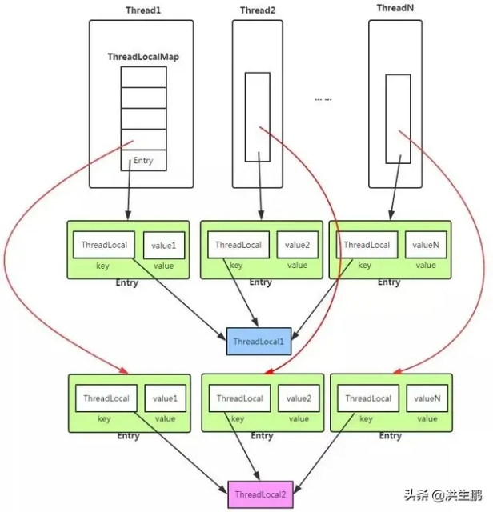

**坑点**

ThreadLocalMap中的entry的key为**弱引用**，在进行YGC的时候弱应用对象会被当做垃圾回收，造成key为null，value无法访问的以至于无法被回收，从而造成内存泄露。

**如何解决**

在使用完threadLocal之后手动调用ThreadLocal的remove()方法手动清理。

## TreeMap

TreeMap 实现了 SortMap 接口，其能够根据键排序，默认是按键的升序排序，也可以指定排序的比较器，当用 Iterator 遍历 TreeMap 时得到的记录是排过序的，所以在插入和删除操作上会有些性能损耗，TreeMap 的键和值都不能为空，其为非并发安全 Map，此外 TreeMap 基于红黑树实现。

[参考文章](https://blog.csdn.net/weixin_41563161/article/details/104986919)

## 阻塞队列

### PriorityQueue

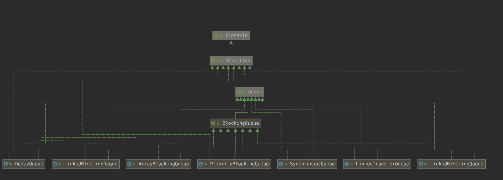

## IO流

### 字节流

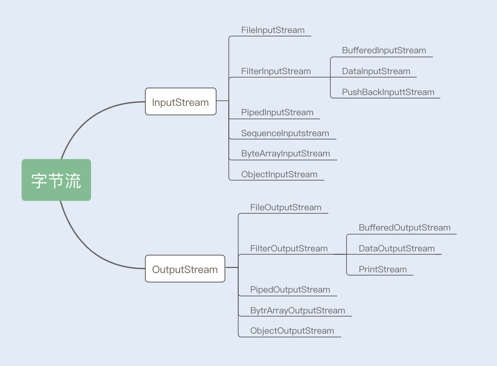

### 字符流


