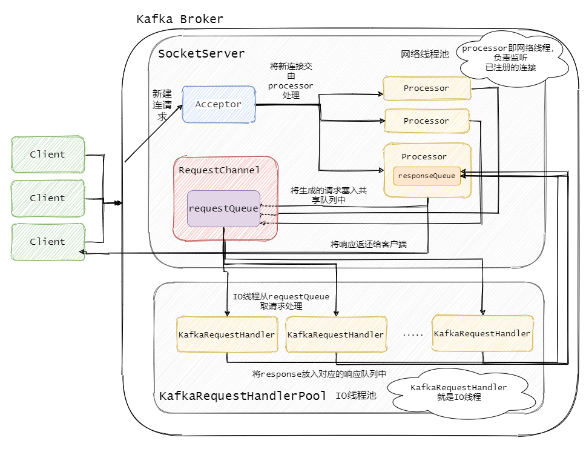
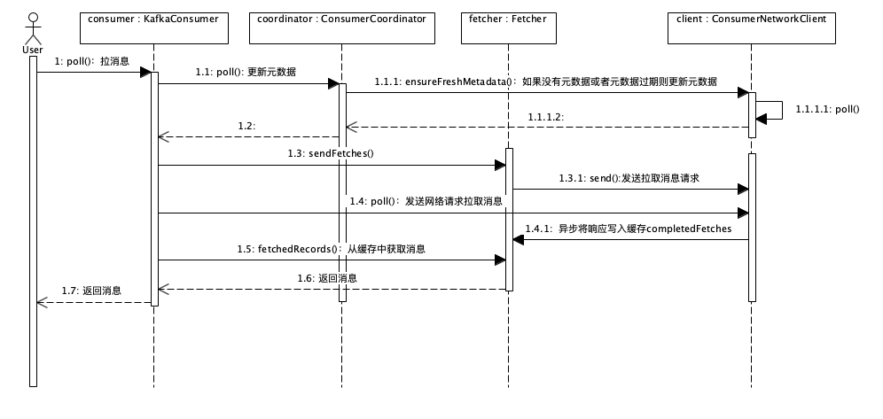

# Kafka

## Kafka 网络处理流程

## Kafka 中 Zookeeper 的作用

ZK负责controller的选举，controller负责replia leader选举

## 高吞吐率实现

- 顺序读写
- 零拷贝
- 批量发送
- 消息压缩

## 消费者消费

Kafka 可以保证在稳定状态下，一条消息只能被同一个 consumer group 中的一个 consumer 消费，当然，一个消息可以同时被多个 consumer group 消费。另外，Kafka 还可以保证，在稳定状态下每一个组内 consumer 只会消费某一个或几个特定的 partition

## 生产者发送消息过程

1. producer 向 broker 集群提交消息发送请求；

2. borker controller 会接收该请求，并根据消息路由策略计算出该消息要写入的 partition；

3. controller 根据消息 topic 及目标 partition，从 zk 中该 topic 下目标 partition 对应的 znode

   状态中找到该 partition 的 leader；

4. controller 向 producer 反馈消息要写入的 partiton leader；

5. producer 接收到来自 controller 的反馈后将消息发送给该 leader；

6. leader 将消息写入本地 log，并通知 ISR 中的 followers；

7. ISR 中的 followers 从 leader 中同步消息后向 leader 发送 ACK；

8. leader 收到所有 ISR 中的 followers 的 ACK 后，增加 HW，表示消费者已经可以消费到该

   位置了。

## 消费者消费过程解析

生产者将消息发送到 topic 中，消费者即可对其进行消费，其消费过程如下：

1. 消费者订阅指定topic的消息；

2. broker controller会为消费者分配partition，并将该partitioin的当前offset发送给消费者；
3. 当broker接收到生产者发送的消息时，broker会将消息推送给消费者；
4. 消费者接收到broker推送的消息后对消息进行消费；
5. 当消费者消费完该条消息后，消费者会向broker发送一个该消息已被消费的反馈，即该消息的 offset；
6. 当broker接到消费者的offset后，会更新到相应的__consumer_offset中；
7. 以上过程一直重复，直到消费者停止请求消息；
8. 消费者可以重置offset，从而可以灵活消费存储在broker上的消息。

## Controller 选举

1. 每个 controller 在 ZK 的 controller path(/controller)注册一个 watcher 监听；
2. 当前 controller失败时，对应的 controller path 会消失，这时候触发 watch，所有或者的 broker 去竞争创建 controller 节点，创建成功的 broker 将成为新的 leader；
3. 竞选成功的 broker 成为 leader，失败者重新注册 watcher。

## Kafka的Leader 选举

1. Leader 选举有 controller执行；
2. 从 ZK 中读取当前分区所有的 ISR 集合；
3. 调用配置的分区选择算法选择分区的 Leader。

## Kafka消息拉取流程

