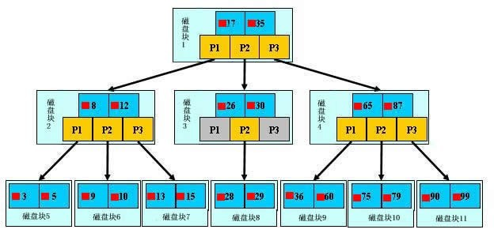
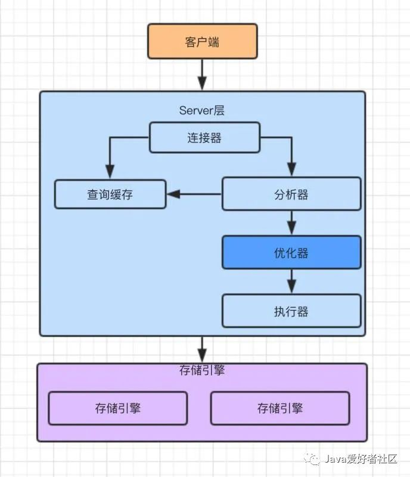
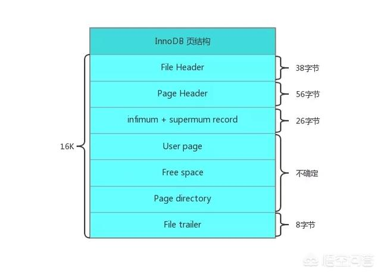
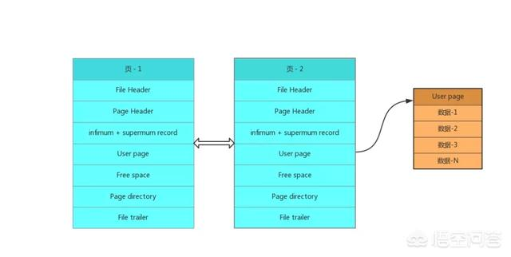
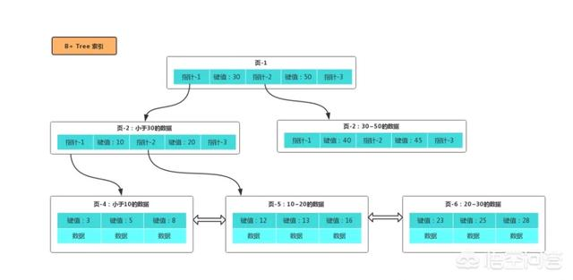
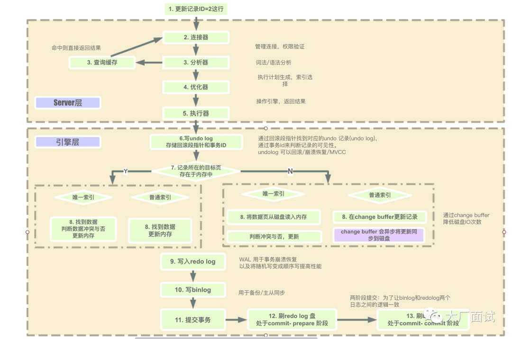
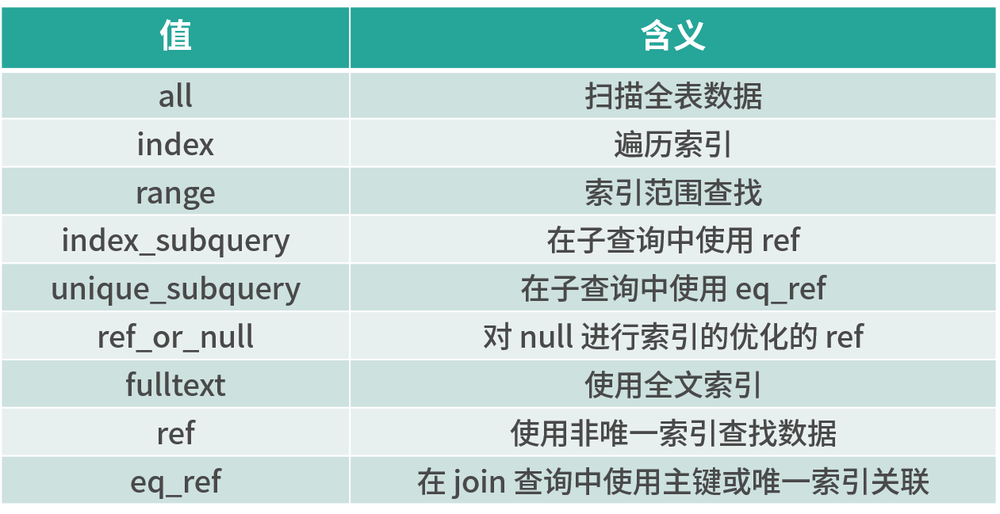

# MySQL

## B+树



`说明：`浅蓝色的块我们称之为一个磁盘块，可以看到每个磁盘块包含几个数据项（深蓝色所示）和指针（黄色所示），如磁盘块1包含数据项17和35，包含指针P1、P2、P3，P1表示小于17的磁盘块，P2表示在17和35之间的磁盘块，P3表示大于35的磁盘块。真实的数据存在于叶子节点即3、5、9、10、13、15、28、29、36、60、75、79、90、99。非叶子节点只不存储真实的数据，只存储指引搜索方向的数据项，如17、35并不真实存在于数据表中。

## MySQL架构



## MySQL 的基本存储结构是页



**在这里，我们需要了解以下几点（非常重要）：**

- 当我们用 MySQL 的 InnoDB 引擎创建表，有且只能有一个主键；如果我们没有显示地指定之间，那么MySQL 会自动生成一个隐含字段作为主键；
- 聚集索引：以主键创建的索引；聚集索引的叶子节点存储的是表中的数据；
- 非聚集索引：非主键创建的索引；非聚集索引在叶子节点存储的是主键和索引列；使用非聚集索引查询数据，会查询到叶子上的主键，再根据主键查到数据，这个过程叫做`回表`。

## 页和页之间、页和数据之间的关系

我们以聚集索引做讲解，页和页之间、以及页和数据之间的关系是这样的：



- 数据页和数据页之间，组成一个双向链表；
- 每个数据页中的记录，是一个单向链表；
- 每个数据页都根据内部的记录生成一个页目录（Page directory），如果是主键的话，可以在页目录中使用二分法快速定位；
- 如果我们根据一个非主键、非索引列进行查询，那么需要遍历双向链表，找到所在的页；再遍历页内的单向链表；如果表内数据很大的话，这样的查询就会很慢。

## B+ Tree 索引的原理

先让我们看看 B+ Tree 索引大概是什么样子（以聚集/主键索引为例）：



- 假如这时候我们要查询 id = 16 的数据：
- 查询页-1，找到页-2 存储的是小于 30 的数据；
- 查询页-2，找到页-5 存储的是 10~20 的数据；
- 查询页-5，找到 id = 16 的数据。

很显然，没有用索引的时候，需要遍历双向链表来定位对应的页，而有了索引，则可以通过一层层“目录”定位到对应的页上。

## 为什么 B+ Tree 索引会降低新增、修改、删除的速度

- B+ Tree 是一颗平衡树，如果对这颗树新增、修改、删除的话，会破坏它的原有结构；
- 我们在做数据新增、修改、删除的时候，需要花额外的时间去维护索引；
- 正因为这些额外的开销，导致索引会降低新增、修改、删除的速度。

## 讲讲一条MySQL的 UPDATE 语句是怎么执行的 ？



### 执行流程：

1. 连接验证及解析

   客户端与MySQL Server建立连接，发送语句给MySQL Server，接收到后会针对这条语句创建一个解析树，然后进行优化，（解析器知道语句是要执行什么，会评估使用各种索引的代价，然后去使用索引以及调节表的连接顺序）然后调用innodb引擎的接口来执行语句。

2. 写undo log

   innodb 引擎首先开启事务，对旧数据生成一个UPDATE的语句(如果是INSERT会生成UPDATE语句)，用于提交失败后回滚，写入undo log，得到回滚指针，并且更新这个数据行的回滚指针和版本号(会设置为更新的事务ID)。

3. 从索引中查找数据

   根据查询条件去B+树中找到这一行数据（如果是唯一性索引，查到第一个数据就可以了，因为有唯一性约束，如果是普通索引，会把所有数据查找出来。）

4. 更新数据

   首先判断数据页是否在内存中？

   4.1 如果数据页在内存中

   先判断更新的索引是普通索引还是唯一性索引？

   	4.1.1 普通索引
		
   	如果更新的索引是普通索引，直接更新内存中的数据页
		
   	4.1.2 唯一性索引
		
   	如果更新的索引是唯一性索引，判断更新后是否会破坏数据的唯一性，不会的话就更新内存中的数据页。

   4.2 如果数据页不在内存中

   先判断更新的索引是普通索引还是唯一性索引？

   	4.2.1 普通索引
		
   	如果是更新的索引是普通索引，将对数据页的更新操作记录到change buffer，change buffer会在空闲时异步更新到磁盘。
		
   	4.2.2 唯一性索引
		
   	如果是更新的索引是唯一性索引，因为需要保证更新后的唯一性，所以不能延迟更新，必须把数据页从磁盘加载到内存，然后判断更新后是否会数据冲突，不会的话就更新数据页。

5. 写redo log（prepare状态）

   将对数据页的更改写入到redo log，将redo log设置为prepare状态。

6. 写bin log（commit状态），提交事务

   通知MySQL server已经更新操作写入到redo log 了，随时可以提交，将执行的SQL写入到bin log日志，将redo log改成commit状态，事务提交成功。（一个事务是否执行成功的判断依据是是否在bin log中写入成功。写入成功后，即便MySQL Server崩溃，之后恢复时也会根据bin log， redo log进行恢复。

### 补充资料

### 二段提交制是什么？

更新时，先改内存中的数据页，将更新操作写入redo log日志，此时redo log进入prepare状态，然后通知MySQL Server执行完了，随时可以提交，MySQL Server将更新的SQL写入bin log，然后调用innodb接口将redo log设置为commited状态，更新完成。
如果只是写了bin log就提交，那么忽然发生故障，主节点可以根据redo log恢复数据到最新，但是主从同步时会丢掉这部分更新的数据。

如果只是写binlog，然后写redo log，如果忽然发生故障，主节点根据redo log恢复数据时就会丢掉这部分数据。

#### MySQL崩溃后，事务恢复时的判断规则是怎么样的？

`以redolog是否commit或者binlog是否完整来确定`

- 如果 redo log 里面的事务是完整的，也就是已经有了 commit 标识，则直接提交；

- 如果 redo log 里面的事务只有完整的 prepare，则判断对应的事务 binlog 是否存在并完整：a. 如果是，则提交事务；b. 否则，回滚事务。

### undo log是什么？

undo log主要是保证事务的`原子性`，事务执行失败就回滚，用于在事务执行失败后，对数据回滚。

undo log是`逻辑日志`，记录的是SQL。（可以认为当delete一条记录时，undo log中会记录一条对应的insert记录，反之亦然，当update一条记录时，它记录一条对应相反的update记录。）

在事务提交后，undo log日志不会立即删除，会放到一个待删除的链表中，有purge线程判断是否有其他事务在使用上一个事务之前的版本信息，然后决定是否可以清理，简单的来说就是前面的事务都提交成功了，这些undo才能删除。

### change buffer是什么？

change buffer 就是将更新数据页的操作缓存下来;

在更新数据时，如果数据行所在的数据页在内存中，直接更新内存中的数据页。

如果不在内存中，为了减少磁盘IO的次数，innodb会将这些更新操作缓存在change buffer中，在下一次查询时需要访问这个数据页时，在执行change buffer中的操作对数据页进行更新。

适合`写多读少`的场景，因为这样即便立即写了，也不太可能会被访问到，延迟更新可以减少磁盘I/O，只有普通索引会用到，因为唯一性索引，在更新时就需要判断唯一性，所以没有必要。

### redo log 是什么？

redo log就是为了保证事务的持久性。因为change buffer是存在内存中的，万一机器重启，change buffer中的更改没有来得及更新到磁盘，就需要根据redo log来找回这些更新。

优点：减少磁盘I/O次数，即便发生故障也可以根据redo log来将数据恢复到最新状态。

缺点：会造成内存脏页，后台线程会自动对脏页刷盘，或者是淘汰数据页时刷盘，此时收到的查询请求需要等待，影响查询。

## InnoDB 和 MyISAM 的区别？

| 对比项                     | InnoDB                   | MyIsam                                             |
| -------------------------- | ------------------------ | -------------------------------------------------- |
| 事务                       | 支持                     | 不支持                                             |
| 锁类型                     | 行锁、表锁               | 表锁                                               |
| 缓存                       | 缓存索引和数据           | 只缓存索引                                         |
| 主键                       | 必须有，用于实现聚簇索引 | 可以没有                                           |
| 索引                       | B+树，主键是聚簇索引     | B+树，非聚簇索引                                   |
| select count(*) from table | 较慢，扫描全表           | 贼快，用一个变量保存了表的行数，只需读出该变量即可 |
| hash索引                   | 支持                     | 不支持                                             |
| 记录存储顺序               | 按主键大小有序插入       | 按记录插入顺序保存                                 |
| 外键                       | 支持                     | 不支持                                             |
| 全文索引                   | 5.7 支持                 | 支持                                               |
| 关注点                     | 事务                     | 性能                                               |

## 建索引的几大原则

1. 最左前缀匹配原则，非常重要的原则，mysql会一直向右匹配直到遇到范围查询(>、<、between、like)就停止匹配，比如a = 1 and b = 2 and c > 3 and d = 4 如果建立(a,b,c,d)顺序的索引，d是用不到索引的，如果建立(a,b,d,c)的索引则都可以用到，a,b,d的顺序可以任意调整。

2. =和in可以乱序，比如a = 1 and b = 2 and c = 3 建立(a,b,c)索引可以任意顺序，mysql的查询优化器会帮你优化成索引可以识别的形式。

3. 尽量选择区分度高的列作为索引，区分度的公式是count(distinct col)/count(*)，表示字段不重复的比例，比例越大我们扫描的记录数越少，唯一键的区分度是1，而一些状态、性别字段可能在大数据面前区分度就是0，那可能有人会问，这个比例有什么经验值吗？使用场景不同，这个值也很难确定，一般需要join的字段我们都要求是0.1以上，即平均1条扫描10条记录。

4. 索引列不能参与计算，保持列“干净”，比如from_unixtime(create_time) = '2014-05-29'就不能使用到索引，原因很简单，b+树中存的都是数据表中的字段值，但进行检索时，需要把所有元素都应用函数才能比较，显然成本太大。所以语句应该写成create_time = unix_timestamp('2014-05-29')。

5. 尽量的扩展索引，不要新建索引。比如表中已经有a的索引，现在要加(a,b)的索引，那么只需要修改原来的索引即可。

## 查询优化神器 - explain命令

这里需要强调`rows`是核心指标，绝大部分rows小的语句执行一定很快（有例外，下面会讲到）。所以优化语句基本上都是在优化rows。

## 慢查询优化基本步骤

1. 先运行看看是否真的很慢，注意设置SQL_NO_CACHE

2. where条件单表查，锁定最小返回记录表。这句话的意思是把查询语句的where都应用到表中返回的记录数最小的表开始查起，单表每个字段分别查询，看哪个字段的区分度最高

3. explain查看执行计划，是否与1预期一致（从锁定记录较少的表开始查询）

4. order by limit 形式的sql语句让排序的表优先查

5. 了解业务方使用场景

6. 加索引时参照建索引的几大原则

7. 观察结果，不符合预期继续从0分析

## 索引优化总结

参考文章：[一本彻底搞懂MySQL索引优化EXPLAIN百科全书](https://mp.weixin.qq.com/s/eJ_ConoGHP6az3IKNe6L2g)

1. 更新非常频繁字段不宜建索引

因为字段更新太频繁，会导致B+树频繁变更，重建索引，所以这个过程是十分消耗数据库性能的。

2. 区分度不大的字段不宜建索引

比如类似性别这类的字段，区分度不大，建立索引的意义不大。因为不能有效过滤数据，性能和全表扫描相当。另外注意一点，返回数据的比例在 `30%` 之外的，优化器不会选择使用索引。

3. 业务中有唯一特性的字段，建议建成`唯一索引`

业务中如果有唯一特性的字段，即使是多个字段的组合，也尽量都建成唯一索引。尽管唯一索引会影响插入效率，但是对于查询的速度提升是非常明显的。此外，还能够提供校验机制，如果没有唯一索引，高并发场景下，可能还会产生脏数据。

4. 多表关联时，要确保关联字段上必须有索引；


6. 最佳索引实践口诀

> 全值匹配我最爱，最左前缀要遵守；
>
> 带头大哥不能死，中间兄弟不能断；
>
> 索引列上少计算，范围之后全失效；
>
> Like百分写最右，覆盖索引不写星；
>
> 不等空值还有or，索引失效要少用；
>
> VAR引号不可丢，SQL高级也不难！

7. `EXPLAIN` 执行计划实践总结

如果还是觉得 `EXPLAIN` 执行计划列太多了，也记不住呀，那么请重点关注以下几列：

`第1列`：ID越大，执行的优先级越高；ID相等，从上往下优先顺序执行。

`第2列`：select_type 查询语句的类型，SIMPLE简单查询，PRIMARY复杂查询，DERIVED衍生查询(from子查询的临时表)，派生表。

`第4列`：请重点掌握，type类型，查询效率优先级：`system -> const -> eq_ref -> ref -> range -> index -> ALL`；

`ALL` 是`最差`的，`system` 是`最好`的，性能最佳，阿里巴巴开发规约中要求最差也得到 `range` 级别，而不能有 `index、ALL`。

## mysql innodb 索引使用指南

[MySQL索引使用指南](https://segmentfault.com/a/1190000018093871)

## undolog，redolog，binlog是什么？

### undo log 是什么？

undo log是一种逻辑日志，是旧数据的备份。有两个作用用于`事务回滚`和`MVCC`。

执行一条INSERT语句时，会记录一条相反的DELETE语句到日志，执行一条UPDATE语句时，会记录一条相反的UPDATE语句到日志中。

### redo log是什么？

**redo log 是 InnoDB引擎特有的物理日志**

redo log用于保证数据的`持久性`。redo log记录的是数据页的物理变化，是新数据的备份，在事务提交前，将redo log 持久化就行，不需要将数据持久化，系统崩溃时，可以根据redo log将数据恢复到最新状态。

redo log只做`顺序追加`操作，当事务需要回滚时，在redo log中也不会删除之前的事务记录。

默认是每次事务提交时必须调用fsync操作将redo缓冲区的内容写入磁盘

例如将A=1修改为A=2

事务开始

将原始数据A=1从磁盘读取到内存，

修改A=2，

生成一条redo log 写入到redo log 缓冲区

调用fsync操作将redo log 缓冲区的内容写入到磁盘

事务提交。

### Bin log 是什么？

保存的是逻辑日志，主要是存储每一条会修改数据的SQL。

## EXPLAIN SQL执行计划字段

 `EXPLAIN` 语句各项输出

| 列名            | **用途**                                               |
| --------------- | ------------------------------------------------------ |
| `id`            | 选择标识符，ID 越大优先级越高，相同的从上到下执行      |
| `select_type`   | SELECT关键字对应的查询类型                             |
| table           | 输出结果集的表名                                       |
| partitions      | 匹配的分区信息                                         |
| `type`          | 单表的连接类型                                         |
| `possible_keys` | 可能用到的索引                                         |
| `key`           | 实际使用到的索引                                       |
| key_len         | 实际使用到的索引字段长度                               |
| ref             | 当使用索引列等值查询时，与索引列进行等值匹配的对象信息 |
| `rows`          | 预估需要读取的记录条数                                 |
| filtered        | 某个表经过条件过滤后剩余的记录条数百分比               |
| `Extra`         | 额外的一些信息                                         |

**以上字段中最重要的就是 `type` 字段，它的所有值如下所示：**



## 大表优化策略

- 限制数据查询范围

- 读写分离

- 垂直拆分

  **优点**

  1. 简化表结构、易于维护
  2. 减少了行数据的大小，一次可以加载更多的数据，也就是说一次可以读取更多数据，减少IO次数

  **缺点**

  1. 主键会出现冗余，需要管理冗余列，并会引起Join操作，可以通过 在应用层进行Join来解决。
  2. 垂直分区会让事务变得更加复杂;

- 水平拆分

  **优点**

  1. **解决了单一表数据过大的问题**，但由于表的数据还是在同一台机器上，其实对于提升MySQL并发能力没有什么意义，所以 水平拆分最好分库 。
  2. 水平拆分能够支持非常大的数据量存储，应用端改造也少

  **缺点**

  1. 分片事务难以解决 ，跨界点Join性能较差，逻辑复杂。

## 数据库分片的解决方案

**客户端代理**

sharding-jdbc、TDDL、Zebra

**中间件代理**

MyCAT、atlas、DDB

## SQL执行顺序

```mysql
FROM <left_table>
ON <join_condition>
<join_type> JOIN <right_table>
WHERE <where_condition>
GROUP BY <group_by_list>
HAVING <having_condition>
SELECT
DISTINCT <select_list>
ORDER BY <order_by_condition>
LIMIT <limit_number>
```

第二步和第三步会循环执行 第四步会循环执行，多个条件的执行顺序是从左往右的。

分组之后才会执行SELECT 前9步都是SQL92标准语法。limit是MySQL的独有语法。

## 讲讲mysql索引，原理是什么，如何优化索引

**索引分类**：主键索引、唯一索引、普通索引、全文索引、组合索引

**原理：**B+树

## 了解MySQL数据库锁的实现原理吗?

1. 锁类型：行锁，表锁。 
2. 行锁的类型：共享锁，排它锁。 
3. 行锁的实现算法：record lock、gap lock、next_key lock。 
4. 手动加锁：乐观锁，基于版本；悲观锁，基于lock，for update。 
5. 死锁：相互等待。

## MySQL事务实现原理

**原子性**：undo log

**隔离性**：锁和MVCC

**持久性**：redo log

**一致性**：前三者

## B树和B+树区别

**B树**两个特点：

- 每个叶子节点都存储数据
- 叶子结点直接没有指针相邻

**B+树**两个特点：

- 只有叶子节点存储数据，非叶子结点不存储数据
- 叶子结点相邻有链指针

**应用场景**

MySQL中InnoDB中聚集索引用到B+树，叶子节点data域存储的是真实的数据行，普通索引用到B树，叶子节点data域存储的是主键值

MyISAM使用B+树，叶子节点data域存储的是真实数据记录的地址

## 为什么Mongodb索引用B树，而Mysql用B+树?

由于关系型数据库和非关系型数据的设计方式上的不同。导致在关系型数据中，遍历操作比较常见，因此采用B+树作为索引，比较合适。而在非关系型数据库中，单一查询比较常见，因此采用B树作为索引，比较合适.

## 为什么 MySQL 索引选择了 B+树而不是 B 树？

- B+树更适合外部存储（一般指磁盘存储），由于内节点（非叶子节点）不存储 data，所以一个节点可以存储更多的内节点，每个节点能索引的范围更大更精确。也就是说使用 B+树单次磁盘 I/O 的信息量相比较 B 树更大，I/O 效率更高。
- MySQL 是关系型数据库，经常会按照区间来访问某个索引列，B+树的叶子节点间按顺序建立了链指针，加强了区间访问性，所以 B+树对索引列上的区间范围查询很友好。而 B 树每个节点的 key 和 data 在一起，无法进行区间查找。

## RR事务隔离级别

REPEATABLE READ解决了脏读的问题。该级别保证了在同一个事务中多次读取同样记录的结果是一致的。但是理论上，可重复读隔离级别还是无法解决另外一个幻读（PhantomRead）的问题。所谓幻读，指的是当某个事务在读取某个范围内的记录时，另外一个事务又在该范围内插入了新的记录，当之前的事务再次读取该范围的记录时，会产生幻行（PhantomRow）。**InnoDB和XtraDB存储引擎通过多版本并发控制（MVCC，Multiversion Concurrency Control）解决了幻读的问题**。

InnoDB采用MVCC来支持高并发，并且实现了四个标准的隔离级别。其默认级别是REPEATABLEREAD（可重复读），并且**通过间隙锁（next key locking）策略防止幻读的出现**。间隙锁使得InnoDB不仅仅锁定查询涉及的行，还会对索引中的间隙进行锁定，以防止幻影行的插入。

## MySQL 到底是怎么解决幻读的？

[MySQL是怎么解决幻读问题的？](https://mp.weixin.qq.com/s/8D6EmZM3m6RiSk0-N5YCww)

首先我们的SELECT查询分为快照读和当前读，`快照读`通过`MVCC`（并发多版本控制）来解决幻读问题，`当前读`通过`行锁`来解决幻读问题。

在快照读读情况下，mysql通过mvcc来避免幻读。

在当前读读情况下，mysql通过next-key来避免幻读。

select * from t where a=1; 属于快照读

select * from t where a=1 lock in share mode; 属于当前读

## MVCC-多版本并发控制

**定义：**多版本并发控制，是一种并发控制的方法，用来解决读-写冲突的无锁并发控制，使得读不加锁，写操作加锁，这里的读指的是**快照读**。

读分为当前读和快照读，当前读是悲观锁的一种实现，而快照读是乐观锁的一种实现。

**实现原理-undo log版本链**

四个隐藏字段：DB_TRX_ID，DB_ROLL_PTR，DB_ROW_ID，flag


**undo log**

insert undo log

insert时产生insert undo log

update undo log

update 或者delete时产生update undo log

**purge线程**

专门来清理delete_bit为true的记录，purge线程维护了一个read view

## RC、RR级别下的InnoDB快照读有什么不同？

- 在RR级别下的某个事务的对某条记录的第一次快照读会创建一个快照及Read View，将当前系统活跃的其他事务记录起来，此后在调用快照读的时候，还是使用的是同一个Read View，所以只要当前事务在其他事务提交更新之前使用过快照读，那么之后的快照读使用的都是同一个Read View，所以对之后的修改不可见；即RR级别下，快照读生成Read View时，Read View会记录此时所有其他活动事务的快照，这些事务的修改对于当前事务都是不可见的，而早于Read View创建的事务所做的修改均是可见的。
- 而在RC级别下的，事务中，每次快照读都会新生成一个快照和Read View，这就是我们在RC级别下的事务中可以看到别的事务提交的更新的原因。

`总结`：

- 在RC隔离级别下，是每个快照读都会生成并获取最新的Read View；

- 在RR隔离级别下，则是同一个事务中的第一个快照读才会创建Read View, 之后的快照读获取的都是同一个Read View。

[参考文章](https://www.jianshu.com/p/8845ddca3b23)

## MyISAM 与 InnoDB 的区别

1. 事务处理上

   MyISAM：强调的是性能，查询的速度比 InnoDB 类型更快，但是不提供事务支持。

   InnoDB：提供事务支持。

2. 外键

   MyISAM：不支持外键。

   InnoDB：支持外键。

3. 锁

   MyISAM：只支持表级锁。

   InnoDB：支持行级锁和表级锁，默认是行级锁，行锁大幅度提高了多用户并发操作的性能。InnoDB 比较适合于插入和更新操作比较多的情况，而 MyISAM 则适用于频繁的查询的情况。另外， InnoDB 表的行锁也不是绝对的，如果在执行一个 SQL 语句时， MySQL 不能确定要扫描的范围，InnoDB 表同样会锁全表，例如： `update table set num=1 where name like '%aaa%';` 。

4. 全文检索

   MyISAM：支持全文检索。

   InnoDB：不支持全文检索。

5. 表主键

   MyISAM：允许没有主键的表存在。

   InnoDB：如果没有主键，则会自动生成一个 6 字节的主键（用户不可见）。

6. 表的具体行数

   MyISAM： `select count(*) from table` ，MyISAM 只要简单的读出保存好的行数。因为 MyISAM 内置了一个计数器， count(*) 时它直接从计数器中读。

   InnoDB：不保存表的具体行数，也就是说，执行 `select count(*) from table` 的时候，InnoDB 要扫描一遍整表来计算有多少行。

## 如何避免长事务对业务的影响？

这个问题，我们可以从应用开发端和数据库端来看。

**首先，从应用开发端来看：**

1. 确认是否使用了 set autocommit=0。这个确认工作可以在测试环境中开展，把 MySQL 的 general_log 开起来，然后随便跑一个业务逻辑，通过 general_log 的日志来确认。一般框架如果会设置这个值，也就会提供参数来控制行为，你的目标就是把它改成 `1`；
2. 确认是否有不必要的只读事务。有些框架会习惯不管什么语句先用 begin/commit 框起来。
3. 业务连接数据库的时候，根据业务本身的预估，通过 SET MAX_EXECUTION_TIME 命令，来控制每个语句执行的最长时间，避免单个语句意外执行太长时间。

**其次，从数据库端来看：**

1. 监控 information_schema.Innodb_trx 表，设置长事务阈值，超过就报警 / 或者 kill；
2. Percona 的 pt-kill 这个工具不错，推荐使用；
3. 在业务功能测试阶段要求输出所有的 general_log，分析日志行为提前发现问题；
4. 如果使用的是 MySQL 5.6 或者更新版本，把 innodb_undo_tablespaces 设置成 2（或更大的值）。如果真的出现大事务导致回滚段过大，这样设置后清理起来更方便。