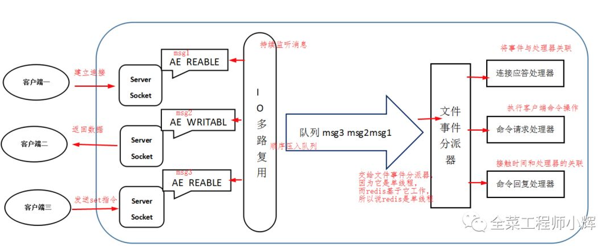

# Redis

## Redis 动态字符串数据结构

参考文章：[Redis 动态字符串数据结构](https://www.toutiao.com/i6842650206077452814)

参考文章：[一文带你快速搞懂动态字符串SDS](https://www.cnblogs.com/chenchen0618/p/13041715.html)

## Redis 的缓存雪崩、缓存穿透和缓存击穿（热点缓存）问题？

1. **缓存雪崩**

> 由于缓存层承载着大量请求，有效地 保护了存储层，但是如果缓存层由于某些原因不能提供服务，比如 Redis 节点挂掉了，热点 key 全部失效了，在这些情况下，所有的请求都会直接请求到数据库，可能会造成数据库宕机的情况。

**预防和解决缓存雪崩问题**，可以从以下三个方面进行着手：

- **使用 Redis 高可用架构**：使用 Redis 集群来保证 Redis 服务不会挂掉
- **缓存时间不一致：** 给缓存的失效时间，加上一个随机值，避免集体失效
- **限流降级策略**：有一定的备案，比如个性推荐服务不可用了，换成热点数据推荐服务。

2. **缓存穿透**

> 缓存穿透是指查询一个根本不存在的数据，这样的数据肯定不在缓存中，这会导致请求全部落到数据库上，有可能出现数据库宕机的情况。

**预防和解决缓存穿透问题**，可以考虑以下两种方法：

- **缓存空对象：** 将空值缓存起来，但是这样就有一个问题，大量无效的空值将占用空间，非常浪费。
- **布隆过滤器拦截：** 将所有可能的查询key 先映射到布隆过滤器中，查询时先判断key是否存在布隆过滤器中，存在才继续向下执行，如果不存在，则直接返回。布隆过滤器有一定的误判，所以需要你的业务允许一定的容错性。

3. **缓存击穿（热点缓存）**

> 大量查询请求某一个 key（热点 key），此时该热点 key 失效，导致大量的请求达到数据库上，从而造成数据库瞬时压力暴增。

**解决缓存击穿的问题方案**

使用分布式锁，将请求串行化处理

## 缓存问题

`问`：在聊到缓存并发问题时，我们说到热点 Key 回源会对数据库产生的压力问题，如果 Key 特别热的话，可能缓存系统也无法承受，毕竟所有的访问都集中打到了一台缓存服务器。如果我们使用 Redis 来做缓存，那可以把一个热点 Key 的缓存查询压力，分散到多个 Redis 节点上吗？

`答：`

> `加随机后缀`
> 分型一个场景：假如在一个非常热点的数据，数据更新不是很频繁，但是查询非常的频繁，要保证基本保证100%的缓存命中率，该怎么处理？
> 我们的做法是，空间换效率，同一个key保留2份，1个不带后缀，1个带后缀，不带的后缀的有ttl，带后缀的没有，先查询不带后缀的，查询不到，做两件事情：1、后台程序查询DB更新缓存；2、查询带后缀返回给调用方，这样可以尽可能的避免`缓存击穿`而引起的数据库挂了。

`问`：大 Key 也是数据缓存容易出现的一个问题。如果一个 Key 的 Value 特别大，那么可能会对 Redis 产生巨大的性能影响，因为 Redis 是单线程模型，对大 Key 进行查询或删除等操作，可能会引起 Redis 阻塞甚至是高可用切换。你知道怎么查询 Redis 中的大 Key，以及如何在设计上实现大 Key 的拆分吗？

`答：`

>1. 单个key存储的value很大
>
>  key分为2种类型：
>
>
> ① 该key需要每次都整存整取
>
>可以尝试将对象分拆成几个key-value， 使用multiGet获取值，这样分拆的意义在于分拆单次操作的压力，将操作压力平摊到多个redis实例中，降低对单个redis的IO影响；
>
>  ② 该对象每次只需要存取部分数据
>
>  可以像第一种做法一样，分拆成几个key-value， 也可以将这个存储在一个hash中，每个field代表一个具体的属性，使用`hget`和`hmget`来获取部分的value，使用`hset`和`hmset`来更新部分属性。
>
>2. 一个集群存储了上亿的key
>
>  如果key的个数过多会带来更多的内存空间占用，① key本身的占用（每个key 都会有一个Category前缀）；
>
>   ② 集群模式中，服务端需要建立一些slot2key的映射关系，这其中的指针占用在key多的情况下也是浪费巨大空间。
>
>这两个方面在key个数上亿的时候消耗内存十分明显（Redis 3.2及以下版本均存在这个问题，4.0有优化）；
>所以减少key的个数可以减少内存消耗，可以参考的方案是转Hash结构存储，即原先是直接使用Redis String 的结构存储，现在将多个key存储在一个Hash结构中，具体场景参考如下：
>
>```reStructuredText
>- key 本身就有很强的相关性，比如多个key 代表一个对象，每个key是对象的一个属性，这种可直接按照特定对象的特征来设置一个新Key——Hash结构， 原先的key则作为这个新Hash 的field。
>```
>
>```properties
>	- key 本身没有相关性，预估一下总量，预分一个固定的桶数量，比如现在预估 key 的总数为2亿，按照一个hash存储 100个field来算，需要 2亿 / 100 = 200W 个桶 (200W 个key占用的空间很少，2亿可能有将近 20G )
>	现在按照200W 固定桶分就是先计算出桶的序号 hash(123456789) % 200W ， 这里最好保证这个 hash算法的值是个正数，否则需要调整下模除的规则；
>这样算出三个key 的桶分别是 1 ， 2， 2。 所以存储的时候调用API hset(key, field, value)，读取的时候使用 hget （key， field）
>注意两个地方：1. hash取模对负数的处理；2.预分桶的时候，一个hash中存储的值最好不要超过512，100左右较为合适
>```

## 集群搭建

哨兵模式

```shell
info sentinel
sentinel masters
sentinel slaves mymaster
```

创建集群

```shell
redis-cli --cluster create 127.0.0.1:7001 127.0.0.1:7002 127.0.0.1:7003 127.0.0.1:7004 127.0.0.1:7005 127.0.0.1:7006 --cluster-replicas 1
```

查看集群

```shell
cluster info
cluster nodes
```

添加节点，默认变为主节点

```shell
redis-cli --cluster add-node 127.0.0.1:7007 127.0.0.1:7001
```

为新增的主节点分配hash槽

```shell
redis-cli --cluster reshard 127.0.0.1:7007

分配的槽数量：number
receiving node:7007的id
源节点：all
```

为主节点添加从节点

```shell
redis-cli --cluster add-node 127.0.0.1:7008 127.0.0.1:7007 --cluster-slave --cluster-master-id id

例：
redis-cli --cluster add-node 127.0.0.1:7008 127.0.0.1:7007 --cluster-slave --cluster-master-id dab473a1a5e95dcf8ef037d19528a8160412cc51
```

删除从节点

```shell
redis-cli --cluster del-node 127.0.0.1:7008 id

例：
redis-cli --cluster del-node 127.0.0.1:7008 dab473a1a5e95dcf8ef037d19528a8160412cc51

```

## 分布式锁

### zk的顺序节点分布式锁


### Redisson实现的非公平锁


## [死磕 Redis—– 如何排查 Redis 中的慢查询](http://cmsblogs.com/?p=18352)

Redis 慢查询有两个参数需要配置：

- `slowlog-log-slower-than`：设置慢查询预设的超时阈值，单位是微秒
- `slowlog-max-len`：表示慢查询日志存储的条数

## **Redis主从同步策略**

`主从刚刚连接的时候，进行全量同步；全同步结束后，进行增量同步`。当然，如果有需要，slave 在任何时候都可以发起全量同步。redis 策略是，无论如何，首先会尝试进行增量同步，如不成功，要求从机进行全量同步。

**需要注意：**如果多个Slave断线了，需重启时，因为只要Slave启动，就会发送sync请求和主机全量同步，当多个同步出现的时候，可能会导致Master IO剧增甚至宕机。

**Redis主从复制的配置十分简单，它可以使从服务器是主服务器的完全拷贝。需要清楚知道Redis主从复制的几点重要内容：**

1. Redis使用异步复制。但从Redis 2.8开始，从服务器会周期性的应答从复制流中处理的数据量。
2. 一个主服务器可以有多个从服务器。
3. 从服务器也可以接受其他从服务器的连接。除了多个从服务器连接到一个主服务器之外，多个从服务器也可以连接到一个从服务器上，形成一个图状结构。
4. **Redis主从复制不阻塞主服务器端**。也就是说当若干个从服务器在进行初始同步时，主服务器仍然可以处理请求。
5. **主从复制也不阻塞从服务器端**。当从服务器进行初始同步时，它使用旧版本的数据来应对查询请求，假设你在redis.conf配置文件是这么配置的。否则的话，你可以配置当复制流关闭时让从服务器给客户端返回一个错误。但是当初始同步完成后，需删除旧数据集和加载新的数据集，在这个短暂时间内，从服务器会阻塞连接进来的请求。
6. 主从复制可以用来增强扩展性，使用多个从服务器来处理只读的请求（比如，繁重的排序操作可以放到从服务器去做），也可以简单的用来做数据冗余。
7. 使用主从复制可以为主服务器免除把数据写入磁盘的消耗：在主服务器的redis.conf文件中配置“避免保存”（注释掉所有“保存“命令），然后连接一个配置为“进行保存”的从服务器即可。但是这个配置要确保主服务器不会自动重启。

## Redis主从复制原理（全量复制和增量复制）


1. 从节点发送指令`psync ? 1`，即`psync runid offset` 找对应的runid索取数据。但是这里可以考虑一下，当从节点第一次连接的时候根本就不知道主节点的runid 和 offset 。所以第一次发送的指令是`psync ？ 1`意思就是主节点的数据我全要。
2. 主节点开始执行`bgsave`生成RDB文件，记录当前的复制偏移量offset。
3. 主节点这个时候会把自己的runid 和 offset 通过 `+FULLRESYNC runid offset` 指令通过socket发送RDB文件给从节点。
4. 从节点接收到`+FULLRESYNC` 保存主节点的runid和offset 然后清空当前所有数据，通过socket接收RDB文件，开始恢复RDB数据。
5. 在全量复制后，从节点已经获取到了主节点的runid和offset，开始发送指令 psync runid offset
6. 主节点接收指令，判断runid是否匹配，判断offset是否在`复制积压缓冲区`中。
7. 主节点判断runid和offset有一个不满足，就会在返回到步骤2继续执行全量复制。这里的runid不匹配只有的可能是从节点重启了。这个问题后边会解决，offset（偏移量）不匹配就是复制积压缓冲区溢出了。 如果runid或offset校验通过，从节点的offset和主节点的offset相同时则忽略。 如果runid或offset检验通过，从节点的offset与offset不相同，则会发送 `+CONTINUE offset`(**这个offset为主节点的**)，通过socket发送复制缓冲区中从节点offset到主节点offset的数据。
8. 从节点收到`+CONTINUE` 保存master的offset，通过socket接收到信息后，执行`bgrewriteaof`，恢复数据。

`1-4是全量复制 5-8是部分复制`

## Redis是单线程的还是多线程的？



单线程只是针对redis中的模块来说 比如 `接受请求和响应是单线程，处理事件也是单线程` 。但是线程不是同一个。

## Redis线程模型


1. 客户端 socket01 向 redis 的 server socket 请求建立连接，此时 server socket 会产生一个 AE_READABLE 事件。
2. IO 多路复用程序监听到 server socket 产生的事件后，将该事件压入队列中。
3. 文件事件分派器从队列中获取该事件，交给`连接应答处理器`。
4. 连接应答处理器会创建一个能与客户端通信的 socket01，并将该 socket01 的 AE_READABLE 事件与`命令请求处理器`关联。
5. 假设此时客户端发送了一个 set key value 请求，此时 redis 中的 socket01 会产生 AE_READABLE 事件，IO 多路复用程序将事件压入队列，此时事件分派器从队列中获取到该事件，由于前面 socket01 的 AE_READABLE 事件已经与命令请求处理器关联，因此事件分派器将事件交给命令请求处理器来处理。命令请求处理器读取 socket01 的 key value 并在自己内存中完成 key value 的设置。操作完成后，它会将 socket01 的 AE_WRITABLE 事件与`命令回复处理器`关联。
6. 如果此时客户端准备好接收返回结果了，那么 redis 中的 socket01 会产生一个 AE_WRITABLE 事件，同样压入队列中，事件分派器找到相关联的命令回复处理器，由命令回复处理器对 socket01 输入本次操作的一个结果，比如 ok，之后解除 socket01 的 AE_WRITABLE 事件与命令回复处理器的关联。

参考：[Redis线程模型](https://www.jianshu.com/p/8f2fb61097b8)

##  Redis 常用数据结构及实现


## 字典的实现是怎样的？

### Redis中的字典

Redis中除了hash这种数据类型存储数据的时候以`key`和`value`构成字典以外，数据库中所有的`key`和`value`也构成的全局字典

### 说明字典内部结构和 rehash

**Redis** 中的字典相当于 Java 中的 **HashMap**，内部实现也差不多类似，都是通过 `数组 + 链表` 的 链`地址法` 来解决部分哈希冲突，同时这样的结构也吸收了两种不同数据结构的优点。

字典结构内部包含 **两个 hashtable**，通常情况下只有一个 `hashtable` 有值，但是在字典扩容缩容时，需要分配新的 `hashtable`，然后进行 **渐进式搬迁** *(rehash)*，这时候两个 `hashtable` 分别存储旧的和新的 `hashtable`，待搬迁结束后，旧的将被删除，新的 `hashtable`取而代之。

### 扩缩容的条件

正常情况下，当 hash 表中 **元素的个数等于第一维数组的长度时**，就会开始扩容，扩容的新数组是 **原数组大小的 2 倍**。不过如果 Redis 正在做 `bgsave(持久化命令)`，为了减少内存也得过多分离，Redis 尽量不去扩容，但是如果 hash 表非常满了，**达到了第一维数组长度的 5 倍了**，这个时候就会 **强制扩容**。

当 hash 表因为元素逐渐被删除变得越来越稀疏时，Redis 会对 hash 表进行缩容来减少 hash 表的第一维数组空间占用。所用的条件是 **元素个数低于数组长度的 10%**，缩容不会考虑 Redis 是否在做 `bgsave`。

## Zset

### 为什么使用跳跃表

首先，因为 zset 要支持随机的插入和删除，所以它 **不宜使用数组来实现**，关于排序问题，我们也很容易就想到 **红黑树/ 平衡树** 这样的树形结构，为什么 Redis 不使用这样一些结构呢？

1. **性能考虑：** 在高并发的情况下，树形结构需要执行一些类似于 rebalance 这样的可能涉及整棵树的操作，相对来说跳跃表的变化只涉及局部 *(下面详细说)*；
2. **实现考虑：** 在复杂度与红黑树相同的情况下，跳跃表实现起来更简单，看起来也更加直观；

基于以上的一些考虑，Redis 基于 **William Pugh** 的论文做出一些改进后采用了 **跳跃表** 这样的结构。

**本质是解决查找问题**

## Redis的数据结构

[字符串的底层数据结构设计](https://www.toutiao.com/i6842650206077452814/?tt_from=weixin&utm_campaign=client_share&wxshare_count=1&timestamp=1593246061&app=news_article&utm_source=weixin&utm_medium=toutiao_android&use_new_style=1&req_id=202006271621000100140481443FCE6157&group_id=6842650206077452814)

### 底层架构

Redis使用了很多数据结构，但是并没有直接使用这些数据结构，而是在这些数据结构的基础上构建了一个对象系统**RedisObject**，对象系统里包含了字符换对象、列表对象、哈希对象、集合对象、有序集合对象。

**使用对象的好处：**

- Redis命令在执行在执行之前，可以根据对象的类型判断是否可以执行给定的命令；
- 针对不同的使用场景可以为对象设置多种不同的数据结构实现，从而优化对象在不同场景下的使用效率

#### 一个对象如何设置不同的数据结构实现？

**Redis对象结构**

- type属性
- encoding属性
- ptr属性

以字符串数据结构为例，执行set命令

```properties
set hello 10086
```

`type`属性设置为`REDIS_STRING`，`encoding`属性设置为`REIDS_ENCODING_INT`，`ptr`属性设置为value值。


接着执行append命令

```properties
append hello a
```

此时encoding属性的标识变为`REDIS_ENCODING_RAW`，表示此值是简单的动态字符串SDS.


正是因为使用对象，通过 type、encoding和prt 属性，使得同一个对象可以适应在不同的场景下，使得不同的改变不需要创建新的键值对，这样使得 Redis 的对象使用效率非常的高。

### 灵活的字符串对象

Redis的字符串对象有三种编码：`int、embstr、raw`

**int**：为了兼容set命令可以设置数值；

**embstr**和**raw**都是用于保存字符串，两者的区别如下：

1. **embstr：**用于保存短字符串，所以它是通过`一次`调用内存分配函数来分配一段连续的内存空间，空间包RedisObject和SDSHdr两种结构，这样可以很好地利用缓存带来的优势。

2. **raw：**用于保存长字符串，通过`两次`调用内存分配函数分别创建RedisObject结构和SDSHdr结构。

   

### 绝妙的字符串优化策略

Redis 中字符串对象的底层是使用 SDS （Simple Dynamic String）实现的。

SDS 有三部分：

- len：记录 buf 数组中已使用字节的数量，等于 SDS 锁保存字符串的长度
- free：记录 buf 数组中未使用字节的数量
- buf[]：字节数组，用于保存字符串

使用 len 属性和 free 属性的好处：

得益于 SDS 有 len 属性，获取字符串长度的复杂度为 O(1);

得益于 SDS 有 free 属性，可以杜绝缓冲区溢出，字符串扩展前可以根据 free 属性来判断是否满足直接扩展，不满足则需要先执行内存重分配操作，然后再扩展字符串。

修改字符串长度很有可能导致触发内存重分配操作，但是 Redis 对于内存重分配有两个优化策略：

**空间预分配：**

- 空间预分配用于优化 SDS 的字符串增长操作：当 SDS 的API对一个 SDS 进行修改，并且需要对 SDS 进行空间扩展的时候，程序不仅会为 SDS 分配修改所必须要的空间，还会为 SDS 分配额外的未使用空间，并使用 free 属性来记录这些额外分配的字节的数量。
- 通过空间预分配策略，下次字符串扩展时，可以充分利用上次预分配的未使用空间，而不用再触发内存重分配操作了。

**惰性空间释放：**

- 惰性空间释放用于优化 SDS 的字符串缩短操作：当 SDS 的API需要缩短 SDS 保存的字符串时，程序并不立即使用内存重分配来回收缩短后多出来的字节，而是使用上面提到的 free 属性将这些字节的数量记录起来，并等待将来使用。
- 通过惰性空间释放策略，SDS 避免了缩短字符串时所需的内存重分配操作，并为将来可能有的增长操作提供了优化。

### 强大的压缩列表 ziplist

简单介绍一下 ziplist 的结构：


- zlbytes：记录整个压缩列表占用的内存字节数；在对压缩列表进行内存重分配时，或者计算 zlend 的位置时使用
- zltail：记录压缩列表表尾节点距离压缩列表的起始地址有多少字节；通过这个偏移量，程序无须遍历真个压缩列表就可以确定表尾节点的地址
- zlen：记录了压缩列表包含的节点数量；当这个属性的值大于 UINT16_MAX(65535)时，节点的真实数量需要遍历整个压缩列表才能计算出来。
- entryX：压缩列表的包含的各个节点，节点的长度由节点保存的内容决定。
- zlend：特殊值0XFF（十进制255），用于标记压缩列表的末端。

压缩列表是一种为节约内存而开发的顺序型数据结构，所以在 Redis 里面压缩列表被用做列表键和哈希键的底层实现之一。

- 当一个列表键只包含少量列表项，并且每个列表项要么就是小整数值，要么就是长度比较短的字符串，那么Redis就会使用压缩列表来做列表键的底层实现。
- 当一个哈希键只包含少量键值对，并且每个键值对的键和值要么就是小整数值，要么就是长度比较短的字符串，那么Redis就会使用压缩列表来做哈希键的底层实现。

正是利用压缩列表，不但使得数据非常紧凑而节约内存，而且还可以利用它的结构来做到非常简单的顺序遍历、逆序遍历，O(1) 复杂度的获取长度和所占内存大小等等。

### Reactor的I/O多路复用

每当别人问 Redis 为啥这么快？脱口而出的不是基于内存就是`基于单线程`。

Redis 使用基于 Reactor 模式实现的网络通信，它使用 I/O 多路复用（multiplexing）程序来同时监听多个套接字，并根据套接字目前执行的任务来为套接字关联不同的事件处理器。

当被监听的套接字准备好执行连接应答（accept）、读取（read）、写入（write）、关闭（close）等操作时，与操作相对应的文件事件就会产生，这时文件事件分派器就会调用套接字之前关联好的事件处理器来处理这些事件。

因为 Redis 是单线程的，所以I/O多路复用程序会利用队列来控制产生事件的套接字的并发；队列中的套接字以有序、同步、每次一个的方式分派给文件事件分派器。


