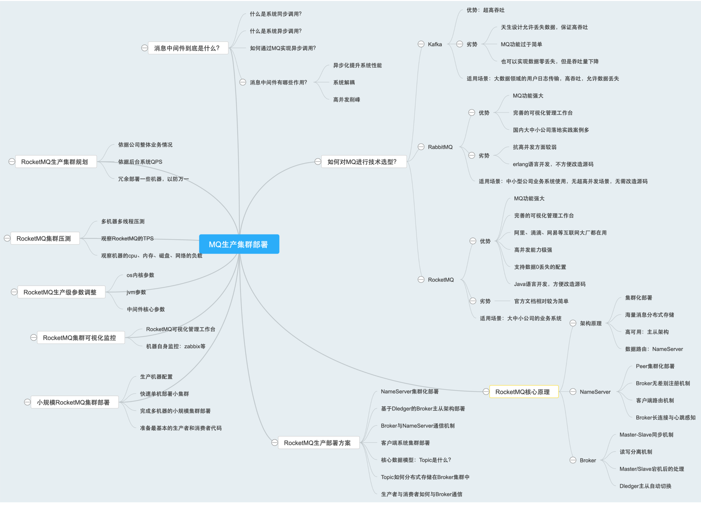
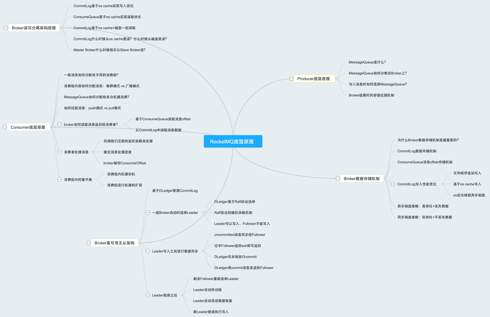
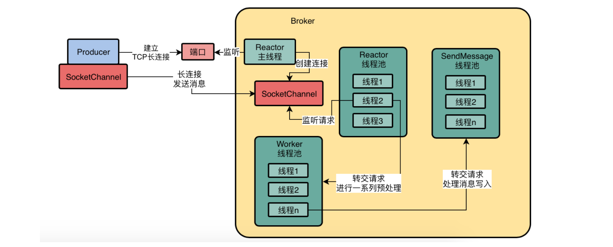
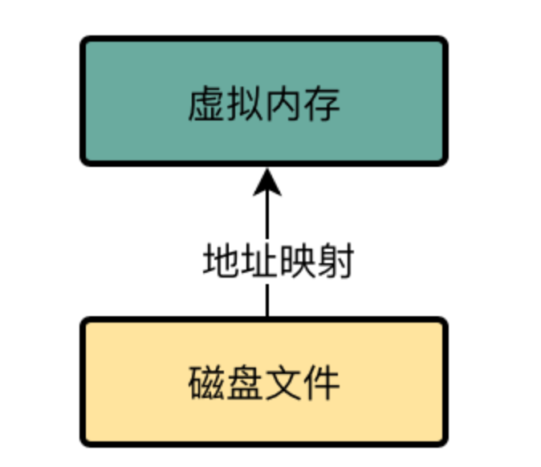

# RocketMQ





## Broker是如何持久化存储消息的

1. MQ收到写请求，首先将消息写入Commitlog，上限制1G；
2. topic下有多个MessageQueue，同时对应多个ConsumerQueue文件，格式$HOME/store/consumerqueue/{topic}/{queueId}/{filename}
3. broker收到一条消息顺序写入commitlog，将这条消息在commitlog中的物理位置，也就是一个文件偏移量offset，写入这条消息所属的messageQueue对应的consumerQueue文件中。

## 如何让消息写入commitlog的性能接近内存写性能

1. pageCache

2. 顺序写，异步刷盘和同步刷盘

## Dledger如何通过Raft协议选举leader broker的？

1. 开始各自投票选自己，并将投票结果通知其他节点
2. 各节点随机休眠，先醒的节点投票给自己并将投票结果同步给其他节点，其他节点一次唤醒根据投票消息进行选举
3. 如果投票结果count(majority) = N /2 + 1个节点投票给自己，就会成为leader。

## Dledger如何通过Raft协议进行多副本同步的？

基于Raft的两阶段完成数据同步，两阶段分别为uncommited阶段和commited阶段

1. leader broker上Dledger收到一条消息之后，标记为uncommitted状态
2. 通过自己的Dledger server组件将uncommitted状态推送给follower的Dledger Server
3. follower收到uncommitted消息之后，必须返回一个ack消息给leader的Dledger server
4. 如果leader收到半数以上的ack消息，就将消息状态由uncommitted变为commited
5. leader上的Dledger server将commited消息发送给follower的Dleger server，让他们把消息状态也变为commited

## 消费者组如何消息处理和ACK的？

消费者组：就是一组消费者组成的，比如A系统部署了两台，这两个系统可以组成一个消费者组，组名XXX

**消费者组只能有一个消费者消费同一个topic的消息**

**不同的消费者组订阅了同一个topic，对于topic中的一条消息，每个消费者组都可以获取**

## 同一个消费者组中的消费者如何消费消息

**集群模式和广播模式**

`集群模式`：一个消费者组中只有一台机器能够消费这条消息

`广播模式`：一个消费者组中每台机器都能消费这条消息

## Push模式和Pull模式

push 模式的实现思路：当消费者请求到 broker 去拉取消息的时候，如果有新的消息可以消费，那么就会立马返回一批消息到消费机器去处理，处理完之后会接着立刻发送请求到 broker 机器去拉取下一批消息。

## Push模式的请求挂起和长轮询机制

消费者获取消息的时候，broker没有可拉取的消息，则请求线程挂起，并启动后台线程轮询查看是否有消息到来，一旦有消息可消费，则唤醒挂起的线程，拉取消息

## 消费者组出现宕机或者或添加机器怎么办？

进入`rebalance`环节，给各个消费机器分配message Queue。

## 消费者如何处理消息以及提交处理进度的？

1. 拉取消息后，将这批消息回调我们注册的一个函数

   ```java
   consumer.registerMessageLsitener(new MessageListenerConcurrently(){
     @Override
     public ConsumeConcurrentlyStatus consumeMessage(List<MessageExt> msgs, ConsumeConcurrentlyContext context){
       //处理消息
       //标记该消息已经被成功消费
       return ConsumeConcurrentlyStatus.CONSUME_SUCCESS;
     }
   });
   ```

2. 处理完消息之后，提交进度给broker，broker会存储消费的进度。

## Consumer Queue的读取基于OS Cache

broker机器上磁盘的consumer Queue文件优先写入os cache

## commit log的读取基于os cache + 磁盘读取

消费者拉取数据的时候可以从os cache中拉取少量的consumer Queue文件中的offset，性能极高，但是读取commit log中完整数据的时候有两种可能

1. 对于刚刚写入commit log中的数据，大概率还停留在os cache中，此时可以轻松的读取到commit log中的完整数据，此为内存读取，性能极高
2. 对于比较老的数据，可能早就被刷盘了，已经写入磁盘中的commit log，已经不在os cache中了，此时只能从磁盘读取，性能就会比较差一些。

## RocketMQ是如何通过Netty扩展出高性能网络通信架构的？

1. Reactor主线程在端口上监听producer建立连接的请求，通过SocketChannel完成建立长连接
2. 建立连接后，Reactor线程池并发的监听多个连接的请求是否到达
3. 请求到达后，由worker线程池并发的对多个请求进行预处理
4. 业务线程池并发的对请求进行磁盘读写业务操作



## 基于mmap内存映射实现commit log磁盘文件的高性能读写？

### 内存映射

物理上的磁盘文件的地址和用户进程私有空间的一些虚拟内存地址的映射



### 预映射和文件预热机制

**内存与映射机制**：broker针对磁盘上的commit log和consumer Queue文件`预先分配`好mappedFile，就是提前对接下来要读写的磁盘文件，使用MappedByteBuffer的map()进行映射，这样后续的写操作就可以直接执行；

**文件预热**：提前尽可能多的把磁盘文件加载到内存中，加载的磁盘块数据的同时会连同相邻的磁盘块数据一起加载

## 基于 RocketMQ 设计的全链路消息零丢失方案总结

**一、全链路消息领丢失方案总结**

1. **发送消息到MQ的零丢失**

   方案一：同步发送消息 + 多次重试

   方案二：事务消息机制（推荐）

2. **MQ收到消息之后的零丢失**

   同步刷盘策略 + 主从架构同步机制，即broker收到消息之后同步刷盘，并同步给其他broker，返回给生产者说写入成功，才能保证MQ不会弄丢数据

3. **消费者端消息零丢失**

   RocketMQ消费者天然保证处理完消息，才会提交消息的offset到broker中，**切记`不可以`使用**多线程异步处理消息的方式

**二、消息零丢失方案的优势和劣势**

	优势：保证消息零丢失
	
	劣势：导致业务系统复杂度以及性能大幅度下降

**三、零丢失方案为什么导致系统性能下降**

	主要在于频繁的请求以及多次磁盘IO操作

**四、消息零丢失方案适用场景**

	设计到金钱交易、核心数据相关的系统和核心链路

**五、幂等设计：避免消息被重复消费**

1. 基于数据库设计，业务ID唯一性**(推荐)**
2. 基于Redis设计，天然幂等，**注意：**介入中间件可能导致不能完全幂等，比如业务处理完成后，系统崩溃导致数据未能写入redis.

**六、消息乱序**

**方案**：

将排序的消息写入同一个MessageQueue，并使用单线程消费。

## RocketMQ 事务消息的流程

