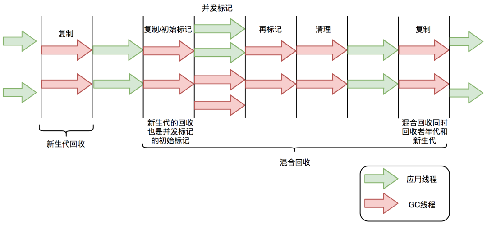

# ZGC 总结

参考文章：[新一代垃圾回收器ZGC的探索与实践](https://mp.weixin.qq.com/s/ag5u2EPObx7bZr7hkcrOTg)

## ZGC 优点

- 停顿时间不超过 10ms;
- 停顿时间不会随着堆内存的大小或者活跃对象的大小而增加；
- 支持 8M ~ 4T级别的堆。

## 适用场景

- 大内存
- 低延迟

## 标记-复制算法

应用在 CMS新生代和 G1垃圾回收器中。可以分为三个阶段：

- 标记阶段，即从 GC Roots 出发，标记活跃的对象；
- 转移阶段，即即把活跃的对象复制到新的内存地址；
- 重新定位阶段，即因为转移导致对象的地址发生了变化，在重定位阶段所有指向对象旧地址的指针都要调整到对象的新地址上。

## G1标记-复制算法的过程



G1 的混合回收阶段可以分为标记阶段、清理阶段和复制阶段：

**标记阶段停顿分析**

- 初始标记阶段：初始阶段是从 GC ROOTS出发标记直接子节点的过程，**该阶段是 STW 的**。由于GC ROOTS 数量不多，所以通常该阶段耗时比较短；
- 并发标记阶段：并发标记阶段是从 GC ROOTS开始对堆中对象进行可达性分析，找出存活对象。该阶段是并发的，也就是说应用线程和 GC 线程可以同时活动。并发标记阶段耗时相对长很多，由于该阶段不是 STW 的，所以我们不太关心该阶段的耗时的长短；
- 重新标记阶段：即重新标记那些在并发标记阶段发生变化的对象，该阶段是 STW 的。

**清理阶段停顿分析**

- 清理阶段会清点出哪些分区有存活对象，哪些分区没有存活对象，该阶段不会清理对象，也不会进行对象的复制。该阶段是 STW 的。

**复制阶段停顿分析**

- 复制算法中的转移阶段需要分配新内存和复制对象的成员变量。该阶段是 STW 的，其中内存分配通常耗时比较短，但是对象成员变量的复制耗时有可能比较长。这是因为对象的复制跟存活对象的数量和对象的复杂度成正比，对象复杂度越高，复制耗时越长。

`4 个 STW`过程中，初始标记因为只标记GC ROOTS，耗时比较短。重新标记因为对象数量少，耗时也比较短。清理阶段因为内存分区数量少，耗时也比较短。转移阶段因为要处理所有存活的对象，所以耗时比较长。因此 G1停顿时间的瓶颈主要是标记-复制过程中的转移阶段 STW。

**为什么转移阶段不能和并发标记阶段一样并发执行？**

> 因为G1 未能解决转移对象过程中准确定位对象地址的问题，也就是说GC 线程执行对象的转移，对象的内存地址发生变化，应用线程有可能访问到对象的旧的地址。

## ZGC 的原理

全并发的 **ZGC**

与CMS 中的 ParaNew和 G1 相似，ZGC也采用了标记-复制算法，不过 ZGC 对该算法做了重大改进：在标记、清理、转移阶段几乎都是并发的，这是 ZGC实现停顿时间小于 10ms 的关键原因。

### ZGC的垃圾回收周期

ZGC只包含三个阶段：`初始标记、重新标记、初始转移`

**初始标记**和**初始转移**都只扫描 GC ROOTS，其处理时间和 GC ROOTS 的数量成正比，一般情况下耗时非常短；

**重新标记阶段**时间非常短，通常不超过 1ms，超过 1ms，则再次进入并发标记阶段。

ZGC几乎所有的停顿只依赖于 GC ROOTS集合的数量，停顿时间不会随着堆内存的大小和活跃对象的数量增加而增加。与 ZGC相比，G1 转移阶段完全是 STW 的，且停顿时间随存活对象的大小增加而增加。

### ZGC的关键技术

`着色指针`和`读屏障`，通过该技术解决了转移对象过程中准确访问对象的问题，实现了并发转移。

#### 实现原理

1. 并发转移中的“并发”意味着GC 线程在转移对象的过程中，应用线程也在不停地访问对象。假设对象发生了转移，但对象地址未及时更新，那么应用线程有可能访问到旧地址，从而造成错误。
2. 在 ZGC 中，应用线程访问对象触发“读屏障”，如果对象被移动了，那么“读屏障”会把读出来的指针指向对象的新地址上，这样应用线程访问的失踪是对象的新地址。

**如何判断对象是否发生转移？**

> 利用对象的引用地址，即着色指针

#### 着色指针

> 着色指针是将信息存储在指针的技术

ZGC 只支持 64 位系统，它把64 位虚拟地址空间划分为多个子空间


其中，[0~4TB) 对应Java堆，[4TB ~ 8TB) 称为M0地址空间，[8TB ~ 12TB) 称为M1地址空间，[12TB ~ 16TB) 预留未使用，[16TB ~ 20TB) 称为Remapped空间。

当应用程序创建对象时，首先在堆空间申请一个虚拟地址，但该虚拟地址并不会映射到真正的物理地址。ZGC同时会为该对象在M0、M1和Remapped地址空间分别申请一个虚拟地址，且这三个虚拟地址对应同一个物理地址，但这三个空间在同一时间有且只有一个空间有效。ZGC之所以设置三个虚拟地址空间，是因为它使用“空间换时间”思想，去降低GC停顿时间。“空间换时间”中的空间是虚拟空间，而不是真正的物理空间。后续章节将详细介绍这三个空间的切换过程。

与上述地址空间划分相对应，ZGC实际仅使用64位地址空间的第0~41位，而第42~45位存储元数据，第47~63位固定为0。


ZGC将对象存活信息存储在42~45位中，这与传统的垃圾回收并将对象存活信息放在对象头中完全不同。

#### 读屏障

> 读屏障是JVM向应用代码插入一小段代码的技术。当应用线程从堆中读取对象引用时，就会执行这段代码。需要注意的是，仅“从堆中读取对象引用”才会触发这段代码。

读屏障示例：

```java
Object o = obj.FieldA   // 从堆中读取引用，需要加入屏障
<Load barrier>
Object p = o  // 无需加入屏障，因为不是从堆中读取引用
o.dosomething() // 无需加入屏障，因为不是从堆中读取引用
int i =  obj.FieldB  //无需加入屏障，因为不是对象引用
```

**ZGC中读屏障的代码作用**：在对象标记和转移过程中，用于确定对象的引用地址是否满足条件，并作出相应动作。

**ZGC并发处理演示**

接下来详细介绍ZGC一次垃圾回收周期中地址视图的切换过程：

- **初始化**：ZGC初始化之后，整个内存空间的地址视图被设置为Remapped。程序正常运行，在内存中分配对象，满足一定条件后垃圾回收启动，此时进入标记阶段。
- **并发标记阶段**：第一次进入标记阶段时视图为M0，如果对象被GC标记线程或者应用线程访问过，那么就将对象的地址视图从Remapped调整为M0。所以，在标记阶段结束之后，对象的地址要么是M0视图，要么是Remapped。如果对象的地址是M0视图，那么说明对象是活跃的；如果对象的地址是Remapped视图，说明对象是不活跃的。
- **并发转移阶段**：标记结束后就进入转移阶段，此时地址视图再次被设置为Remapped。如果对象被GC转移线程或者应用线程访问过，那么就将对象的地址视图从M0调整为Remapped。

其实，在标记阶段存在两个地址视图M0和M1，上面的过程显示只用了一个地址视图。之所以设计成两个，是为了区别前一次标记和当前标记。即第二次进入并发标记阶段后，地址视图调整为M1，而非M0。

`着色指针`和`读屏障`技术不仅应用在并发转移阶段，还应用在并发标记阶段：将对象设置为已标记，传统的垃圾回收器需要进行一次内存访问，并将对象存活信息放在对象头中；而在ZGC中，只需要设置指针地址的第42~45位即可，并且因为是寄存器访问，所以速度比访问内存更快。


