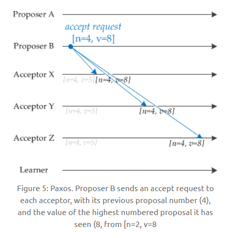

# Zookeeper

## Zookeeper 为了满足分布式系统的需求要有哪些特点？

Zookeeper 肯定是一套系统，这个系统可以存储元数据，支持 Master 选举，可以进行分布式协调和通知；

集群部署：不可能使用单机版本；

顺序一致性：所有的请求全部有序；

原子性：要么全部机器都成，要么全部机器都失败；

数据一致性：无论连接到那个 ZK 上去，看到的数据都是一样的，不可能数据不一致；

高可用：如果某台机器宕机，要保证数据绝对不能丢失；

实时性：一旦数据发生变更，其他机器要实时感知到。

## Paxos算法

[Paxos算法介绍](https://cyc2018.github.io/CS-Notes/#/notes/分布式)

用于达成共识性问题，即对多个节点产生的值，该算法能保证只选出唯一一个值。

主要有三类节点：

- 提议者（Proposer）：提议一个值；
- 接受者（Acceptor）：对每个提议进行投票；
- 告知者（Learner）：被告知投票的结果，不参与投票过程。

## [执行过程](https://cyc2018.github.io/CS-Notes/#/notes/分布式?id=执行过程)

规定一个提议包含两个字段：[n, v]，其中 n 为序号（具有唯一性），v 为提议值。

### [1. Prepare 阶段](https://cyc2018.github.io/CS-Notes/#/notes/分布式?id=_1-prepare-阶段)

下图演示了两个 Proposer 和三个 Acceptor 的系统中运行该算法的初始过程，每个 Proposer 都会向所有 Acceptor 发送 Prepare 请求。

当 Acceptor 接收到一个 Prepare 请求，包含的提议为 [n1, v1]，并且之前还未接收过 Prepare 请求，那么发送一个 Prepare 响应，设置当前接收到的提议为 [n1, v1]，并且保证以后不会再接受序号小于 n1 的提议。

如下图，Acceptor X 在收到 [n=2, v=8] 的 Prepare 请求时，由于之前没有接收过提议，因此就发送一个 [no previous] 的 Prepare 响应，设置当前接收到的提议为 [n=2, v=8]，并且保证以后不会再接受序号小于 2 的提议。其它的 Acceptor 类似。

如果 Acceptor 接收到一个 Prepare 请求，包含的提议为 [n2, v2]，并且之前已经接收过提议 [n1, v1]。如果 n1 > n2，那么就丢弃该提议请求；否则，发送 Prepare 响应，该 Prepare 响应包含之前已经接收过的提议 [n1, v1]，设置当前接收到的提议为 [n2, v2]，并且保证以后不会再接受序号小于 n2 的提议。

如下图，Acceptor Z 收到 Proposer A 发来的 [n=2, v=8] 的 Prepare 请求，由于之前已经接收过 [n=4, v=5] 的提议，并且 n > 2，因此就抛弃该提议请求；Acceptor X 收到 Proposer B 发来的 [n=4, v=5] 的 Prepare 请求，因为之前接收到的提议为 [n=2, v=8]，并且 2 <= 4，因此就发送 [n=2, v=8] 的 Prepare 响应，设置当前接收到的提议为 [n=4, v=5]，并且保证以后不会再接受序号小于 4 的提议。Acceptor Y 类似。

### [2. Accept 阶段](https://cyc2018.github.io/CS-Notes/#/notes/分布式?id=_2-accept-阶段)

当一个 Proposer 接收到超过一半 Acceptor 的 Prepare 响应时，就可以发送 Accept 请求。

Proposer A 接收到两个 Prepare 响应之后，就发送 [n=2, v=8] Accept 请求。该 Accept 请求会被所有 Acceptor 丢弃，因为此时所有 Acceptor 都保证不接受序号小于 4 的提议。

Proposer B 过后也收到了两个 Prepare 响应，因此也开始发送 Accept 请求。需要注意的是，Accept 请求的 v 需要取它收到的最大提议编号对应的 v 值，也就是 8。因此它发送 [n=4, v=8] 的 Accept 请求。

### [3. Learn 阶段](https://cyc2018.github.io/CS-Notes/#/notes/分布式?id=_3-learn-阶段)

Acceptor 接收到 Accept 请求时，如果序号大于等于该 Acceptor 承诺的最小序号，那么就发送 Learn 提议给所有的 Learner。当 Learner 发现有大多数的 Acceptor 接收了某个提议，那么该提议的提议值就被 Paxos 选择出来。

## Zookeeper下Server的工作状态

每个server都有三种状态：

- LOOKING：当前节点不知道谁是leader，正在搜寻；
- LEADING：当前server选出leader后的状态
- FOLLOWING：leader选举出来之后，同步给其他follower

## Zookeeper如何保证数据的一致性？

1. 保证数据一致性有两种情况：第一重新选举leader之后的数据同步；第二leader处理完事务请求后与follower保持同步
2. 首先分为三个角色，事务请求全部由leader处理；
3. 当leader收到请求后，将请求事务转化为事务proposal，由于leader会为每一个follower创建一个队列，将该事务放入到响应队列，保证数据的顺序性
4. 之后会向队列中顺序向其他节点广播提案，follower收到后会以事务的形式写入到本地日志中，并向leader发送反馈ack；
5. leader会等待其他folllower的回复，收到一半以上的follower响应时，leader会向其他节点发送commit消息，同时提交该提案。

