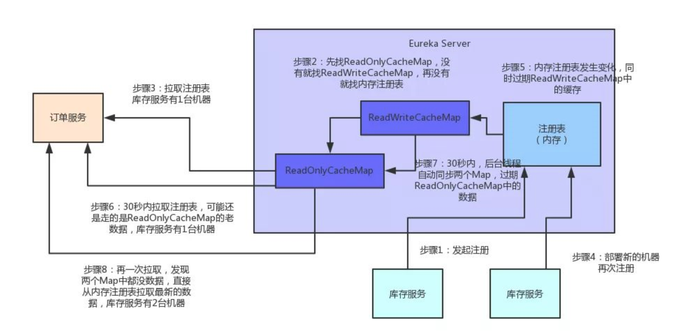

## 微服务

## Eureka 多级缓存机制

## Hystrix隔离原理

### 用途

- 隔离

- 熔断

- 降级
- 限流

> **hystrix 隔离原理分为`线程隔离`和`信号量隔离`**

### 信号量隔离

即 hystrix 的限流功能。ratelimiter的令牌桶算法和漏桶算法，都是直接对请求量来计数。hystrix信号量隔离限制的是tomcat等Web容器线程数，一段时间仅仅能支持这么多。多余的请求再来请求线程资源，就被拒绝了。

### 线程隔离

引入额外的线程，对原来 web 容器中的线程进行管理：如果某个线程长时间没有返回，则熔断。由于引入线程会涉及到线程池的管理、线程上下文切换这些开销，所以线程隔离的成本更大

