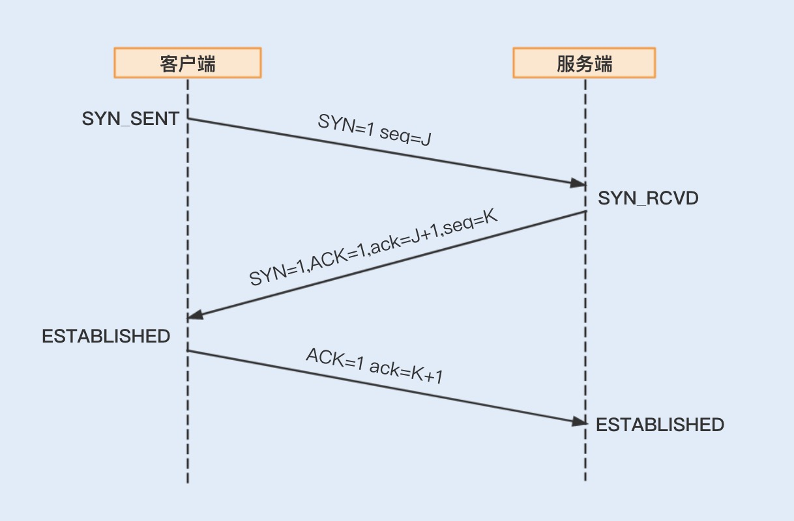
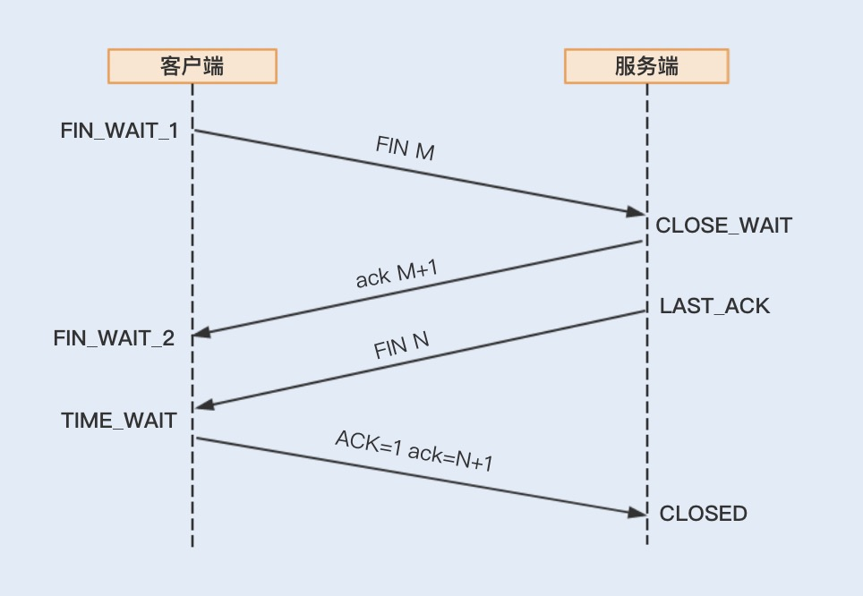
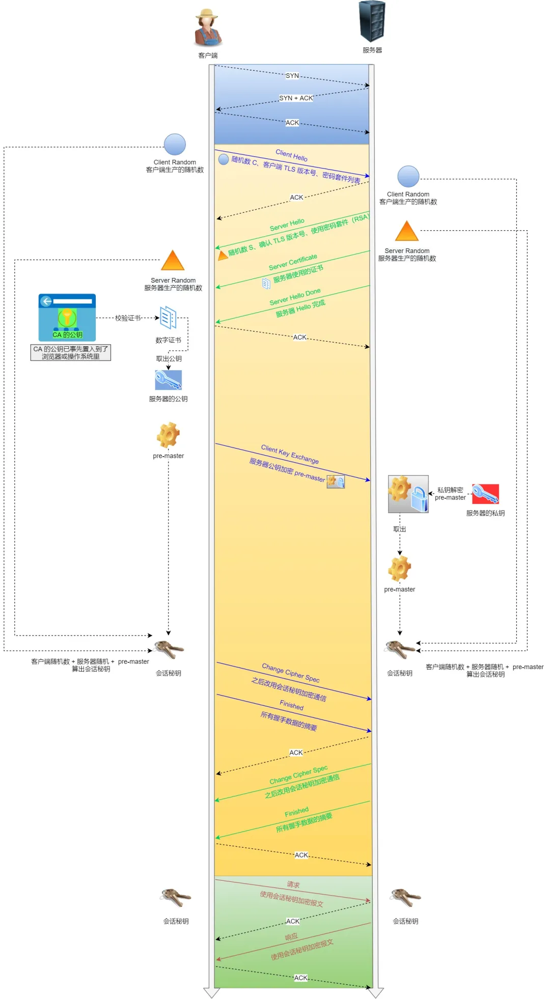
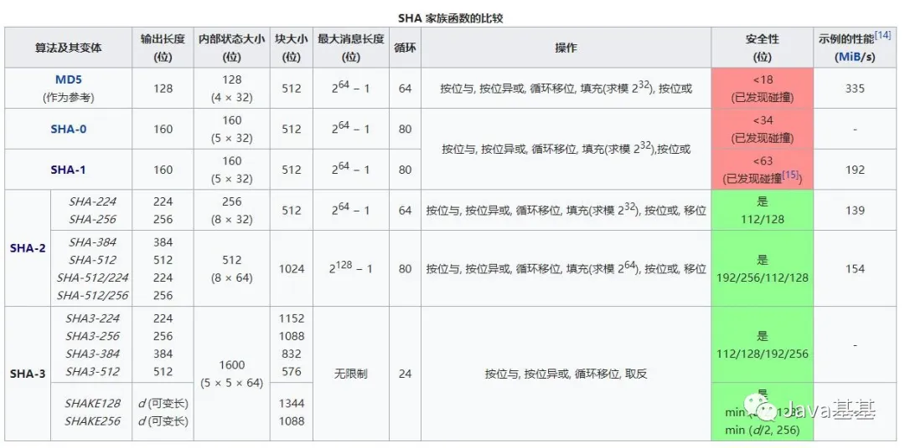

# 网络

## 服务器端Socket监听80端口，建立连接传输数据时也是使用的80端口么？

1. 服务器端Socket监听80端口，建立连接传输数据时也是使用的80端口么？

答：对。建立连接时服务器会分配一个新的Socket，但是用的源端口号还是80端口。套接字是由协议类型、源IP、目的IP和源端口、目的端口五部分组成的。理论上讲，不同连接的套接字只要满足这五部分不完全相同即可。只要不完全相同，收发数据时就能区分不同连接的数据。

附：这也是通过tcpdump等网络抓包工具抓取服务器监听端口的数据可以抓取到该服务下所有连接的网络包的原因所在。

2. 使用同一端口号收发数据，是不是会导致带宽利用率降低，或者端口阻塞？

答：不会。端口只是一个数字，并非实际的物理端口，所以不存在端口阻塞的问题。在数据的通信网络传输过程中，只用到了网络层、链路层和物理层。端口是传输层的东西，和它没有关系。所以，端口号会影响带宽使用的认识是错误的。

## 能不能说说一般黑客常用的XSS网络攻击的原理是什么

1. XSS全称是跨站点脚本攻击，原理就是想办法把恶意脚本加载到浏览器然后运行。主要方式有`反射型`和`持久型`。 
2. `反射型`：访问一些不怎么正规的网站，然后那个网站可以被黑客发布广告，然后用户点击广告以后，就会跳转到黑客搭建的一个后台，然后就会返回一段恶意脚本给浏览器，然后恶意脚本就可以在浏览器运行，做一些很卑劣的事情。 
3. `持久型`：黑客可以向博客、论坛性质的网站，提交一些恶意评论，评论内容里面包含了一段恶意代码。如果该网站不进行相关的处理，那么在一个用户浏览到该评论的时候，这个恶意评论就会被读取到浏览器，进而执行。 
4. 解决方案： 作为用户，我们尽量少点。 作为博客、论坛的后台开发，我们需要对用户提交的评论进行特殊符号转义，让恶意代码失效。 作为一些网站的后台开发，我们需要将cookie打上`HttpOnly`属性，就不让恶意脚本获取cookie信息。

## TCP/IP网络模型总结

1. 物理层：物理设备，传输0/1电路信号。 
2. 数据链路层：解析/组包电路信号，走`以太网协议`，封装对应带有mac地址的数据包。 
3. 网络层：通过IP再次对底层网络进行抽象，将网络划分为局域网，广域网等等。 
4. 传输层：TCP/UDP等协议作用层。 
5. 应用层：HTTP/STMP等协议作用层。 

各层对应的硬件设备

1. **交换机**：作用于`数据链路层`，作用是广播以太网数据包。 
2. **路由器**(网关)：作用于`网络层`，连接多个子网。 
3. **ARP协议**：作用于`数据链路层`，主要是通过广播的方式，拿到目标IP的对应mac地址，并缓存一段时间。 
4. **DNS协议**：作用于`应用层`，主要是通过UDP的方式拿到域名对应的IP地址。 
5. 整个过程：数据包由应用层对应的协议产生，然后向下逐一封装，TCP报文 -> IP报文 -> 以太网报文。最后由交换机广播在整个子网内，如果目标mac地址不在同一子网内，会由路由器去一次次转发，最后目标子网的网关接收到，发现目标电脑的mac地址在自己的子网内，于是再通过交换机在自己的子网内广播，最终目标电脑接收到报文。

## 浏览器发送HTTP请求的大概过程

1. DNS域名解析，通过UDP广播的方式拿到对应域名的IP。 
2. 拿到IP以后进行子网判断，如果不在同一个子网内，则向下进行组包。 
3. 应用层组http的请求报文，传输层组TCP报文，网络层组网络协议报文，数据链路层组以太网协议报文。 
4. 组好报文后由网关进行路由发出，经过层层的转发，最终到达目标服务器。 
5. 目标服务器收到对应的报文后，层层解析，最终交付应用层HTTP报文，由对应的服务处理后响应。 
6. 最终服务器返回的网络资源经过同样的过程到达用户电脑，并由浏览器展示。

## Http请求的完全过程

1. 浏览器根据域名解析IP地址（DNS），并查DNS缓存
2. 浏览器与WEB服务器建立一个TCP连接
3. 浏览器给WEB服务器发送一个HTTP请求（GET/POST）：一个HTTP请求报文由请求行（request line）、请求头部（headers）、空行（blank line）和请求数据（request body）4个部分组成。
4. 服务端响应HTTP响应报文，报文由状态行（status line）、相应头部（headers）、空行（blank line）和响应数据（response body）4个部分组成。
5. 浏览器解析渲染

## HTTP的常见状态码有哪些，代表什么含义？

首先状态码的开头不同代表不同的类型：

1xx：代表指示信息，表示请求已接收，继续处理

2xx：代表成功，表示请求已被成功接收，理解，接受

3xx：重定向，表示完成请求必须进行进一步的操作

4xx：客户端错误，请求有语法错误或请求无法实现

5xx：服务器端错误，服务器未能实现合法的请求

常见状态码：

200 OK：正常返回信息

400 Bad Request：客户端请求有语法错误，不能被服务器所理解

403 Forbidden：服务器收到请求，但是拒绝提供服务

404 Not Found：请求资源不存在，输入了错误的URL

**499 状态码**

499这个状态码并不是 http协议中定义的标准状态码，而是 Nginx自己定义的一个状态码。
当客户端主动断开连接的时候，Nginx就会返回499的状态码。按照这个状态码的定义，只要在Nginx返回结果之前主动断开客户端连接，就应该会复现这个状态码。

500 Internal Server Error：服务器发生不可预期错误

502 Bad Geteway：Nginx 502错误的原因⽐较多，主要是因为在代理模式下后端服务器出现问题引
起的。这些错误⼀般都不是Nginx本身的问题，⼀定要从后端找原因。

503 Server Unavailable：服务器当前不能处理客户端的请求，一段时间后可能恢复正常

504 错误代表网关超时

505 http的版本是不受支持的

## 画一下TCP三次握手流程图？为啥是三次而不是二次或者四次呢？

三次握手、四次挥手、以及其他TCP协议的控制套件都是为了保证可靠传输。 

1. 三次握手：保证client-server都可以进行可靠收发，第三次是为了确认服务端的可靠收发。还有一种说法就是如果两次就建立连接的话，会因为网络的原因，有些第一次握手的请求滞后了，导致服务端额外的开销，因此出现这种请求，就需要第三次握手去复位连接，释放掉服务端资源。 
2. 四次挥手，主要是第二次挥手后服务端依旧可以发送数据，然后client在发出第四次挥手后需要等待2MSL的时间才会进入closed状态。具体原因也是出于可靠传输，一是为了防止第四次挥手的消息超时，2MSL的时间可以处理超时重发。 二是为了防止该client在服务端确认关闭前再次连接上该server，保证该连接被正确关闭。挥手过程耗时相对较长，所以说频繁的创建和关闭TCP连接的开销比较大。

## 三次握手

- 第一次握手：建立连接时，客户端发送syn包（syn=x）到服务器，并进入SYN_SENT状态，等待服务器确认；SYN：同步序列编号（Synchronize Sequence Numbers）。

- 第二次握手：服务器收到syn包，必须确认客户的SYN（ack=x+1），同时自己也发送一个SYN包（syn=y），即SYN+ACK包，此时服务器进入SYN_RECV状态；

- 第三次握手：客户端收到服务器的SYN+ACK包，向服务器发送确认包ACK(ack=y+1），此包发送完毕，客户端和服务器进入ESTABLISHED（TCP连接成功）状态，完成三次握手。

## 为什么不能两次握手

TCP是一个双向通信协议，通信双方都有能力发送信息，并接收响应。如果只是两次握手， 至多只有连接发起方的起始序列号能被确认， 另一方选择的序列号则得不到确认

## 四次挥手

1. 客户端进程发出连接释放报文，并且停止发送数据。释放数据报文首部，FIN=1，其序列号为seq=u（等于前面已经传送过来的数据的最后一个字节的序号加1），此时，客户端进入FIN-WAIT-1（终止等待1）状态。TCP规定，FIN报文段即使不携带数据，也要消耗一个序号。
2. 服务器收到连接释放报文，发出确认报文，ACK=1，ack=u+1，并且带上自己的序列号seq=v，此时，服务端就进入了CLOSE-WAIT（关闭等待）状态。TCP服务器通知高层的应用进程，客户端向服务器的方向就释放了，这时候处于半关闭状态，即客户端已经没有数据要发送了，但是服务器若发送数据，客户端依然要接受。这个状态还要持续一段时间，也就是整个CLOSE-WAIT状态持续的时间。
3. 客户端收到服务器的确认请求后，此时，客户端就进入FIN-WAIT-2（终止等待2）状态，等待服务器发送连接释放报文（在这之前还需要接受服务器发送的最后的数据）。
4. 服务器将最后的数据发送完毕后，就向客户端发送连接释放报文，FIN=1，ack=u+1，由于在半关闭状态，服务器很可能又发送了一些数据，假定此时的序列号为seq=w，此时，服务器就进入了LAST-ACK（最后确认）状态，等待客户端的确认。
5. 客户端收到服务器的连接释放报文后，必须发出确认，ACK=1，ack=w+1，而自己的序列号是seq=u+1，此时，客户端就进入了TIME-WAIT（时间等待）状态。注意此时TCP连接还没有释放，必须经过2MSL（最长报文段寿命）的时间后，当客户端撤销相应的TCB后，才进入CLOSED状态。
6. 服务器只要收到了客户端发出的确认，立即进入CLOSED状态。同样，撤销TCB后，就结束了这次的TCP连接。可以看到，服务器结束TCP连接的时间要比客户端早一些

## 聊聊HTTP协议的工作原理

http：主要是分为head+body。 

http1.0：短连接，每次请求都需要单独建立连接，在获取响应后关闭连接。效率低，不利于复杂网页的加载。 

http1.1：支持TCP长连接，在请求头里面加了一行keep-alive。从而提高效率。 

http2.0：有一些新特性，例如多路复用，首部压缩，服务器推送等等。主要是为了进一步提高性能。

## HTTPS的工作原理

1. 发送自身支持的加密规则，然后网站返回对应的证书回来。
2. 浏览器校验证书后出现一把小锁，然后生成随机数，计算消息hash值，再用该随机数对消息进行加密，最后将随机数进行公钥加密，发送给网站。网站收到消息后，先对整体随机数进行私钥解密，再通过随机数解密消息，对比其hash值，确认未被篡改。 
3. 网站再用随机数发送确认，之后浏览器确认以后，那么以后就用随机数进行加密后进行通信。 
4. 这个随机数是不能被第三方获取的，因为一开始是浏览器自己生成的，然后发送出去的时候已经用公钥加密了，没有私钥就解不出来。因此，这个随机密码就只会有浏览器和目标网站能拿到。

## HTTPS建立连接的过程

建立 HTTPS 连接的过程，首先是 TCP 握手，然后是 TLS 握手的一系列工作，包括：

1. 客户端告知服务端自己支持的密码套件（比如 TLS_RSA_WITH_AES_256_GCM_SHA384，其中 RSA 是密钥交换的方式，AES_256_GCM 是加密算法，SHA384 是消息验证摘要算法），提供客户端随机数。
2. 服务端应答选择的密码套件，提供服务端随机数。
3. 服务端发送 CA 证书给客户端，客户端验证 CA 证书（后面详细说明）。
4. 客户端生成 PreMasterKey，并使用非对称加密 + 公钥加密 PreMasterKey。
5. 客户端把加密后的 PreMasterKey 传给服务端。
6. 服务端使用非对称加密 + 私钥解密得到 PreMasterKey，并使用 PreMasterKey+ 两个随机数，生成 MasterKey。
7. 客户端也使用 PreMasterKey+ 两个随机数生成 MasterKey。
8. 客户端告知服务端之后将进行加密传输。
9. 客户端使用 MasterKey 配合对称加密算法，进行对称加密测试。
10. 服务端也使用 MasterKey 配合对称加密算法，进行对称加密测试。

## 能不能说一说 TCP 和 UDP 的区别？

首先概括一下基本的区别:

**TCP是一个`面向连接的`、`可靠的`、基于`字节流`的传输层协议。**

而**UDP是一个`面向无连接`的传输层协议。**

具体来分析，和 `UDP` 相比，`TCP` 有三大核心特性:

1. **面向连接**。所谓的连接，指的是客户端和服务器的连接，在双方互相通信之前，TCP 需要三次握手建立连接，而 UDP 没有相应建立连接的过程。
2. **可靠性**。TCP 花了非常多的功夫保证连接的可靠，这个可靠性体现在哪些方面呢？一个是`有状态`，另一个是`可控制`。

TCP 会精准记录哪些数据发送了，哪些数据被对方接收了，哪些没有被接收到，而且保证数据包按序到达，不允许半点差错。这是`有状态`。

当意识到丢包了或者网络环境不佳，TCP 会根据具体情况调整自己的行为，控制自己的发送速度或者重发。这是`可控制`。

相应的，UDP 就是`无状态, 不可控`的。

3. **面向字节流**，UDP 的数据传输是基于数据报的，这是因为仅仅只是继承了 IP 层的特性，而 TCP 为了维护状态，将一个个 IP 包变成了字节流。

## TCP/UDP

## TCP粘包

**TCP粘包**是指发送方发送的若干包数据到接收方接收时粘成一个包，从接收缓冲区看，后一包数据的头紧接着前一包数据的尾。

### 粘包发生在那些情况下？

TCP是**端到端**传输的，同时TCP连接是`可复用`的。什么叫复用呢？复用就是一条连接可以供一台主机上的多个进程使用。

1. 由TCP连接复用造成的粘包问题。

如果没有复用，一个连接只提供给端到端的两个进程使用，这是数据的传输方和发送方都是约定好了数据的格式的，但是**多个进程**使用一个TCP连接，此时`多种不同结构`的数据进到TCP的流式传输，边界分割肯定会出这样或者那样的问题。

如果利用tcp每次发送数据，就与对方建立连接，然后双方发送完一段数据后，就关闭连接，这样就不会出现粘包问题

2. 因为TCP默认会使用Nagle算法，此算法会导致粘包问题。

而Nagle算法主要做`两件事`：

- 只有上一个分组得到确认，才会发送下一个分组；

- 收集多个小分组，在一个确认到来时一起发送。

多个分组拼装为一个数据段发送出去，如果没有好的边界处理，在解包的时候会发生粘包问题。

3. 数据包过大造成的粘包问题。

比如应用进程缓冲区的一条消息的字节的大小超过了发送缓冲区的大小，就有可能产生粘包问题。因为消息已经被分割了，有可能一部分已经被发送出去了，对方已经接受了，但是另外一部分可能刚放入套接口发送缓冲区里准备进一步发送，就直接导致接受的后一部分，直接导致了粘包问题的出现。

4. 流量控制，拥塞控制也可能导致粘包。

5. 接收方不及时接收缓冲区的包，造成多个包接收。

## 常见的加密算法

